# WeatherPy
----

#### Note
* Instructions have been included for each segment. You do not have to follow them exactly, but they are included to help you think through the steps.

## Analysis

* Weather gets warmer and warmer as it approches to the equator.
* We don't see significant relationship between latitude and speed.
* We don't see significant relationship between latitude and wind speed. Some cities in the northern hemispheres reach 20 mph of wind.


```python
# Dependencies and Setup
import matplotlib.pyplot as plt
import pandas as pd
import numpy as np
import requests
import time
from scipy.stats import linregress

# Import API key
from api_keys import weather_api_key

# Incorporated citipy to determine city based on latitude and longitude
from citipy import citipy

# Output File (CSV)
output_data_file = "output_data/cities.csv"

# Range of latitudes and longitudes
lat_range = (-90, 90)
lng_range = (-180, 180)
```

## Generate Cities List


```python
# List for holding lat_lngs and cities
lat_lngs = []
cities = []

# Create a set of random lat and lng combinations
lats = np.random.uniform(lat_range[0], lat_range[1], size=9900)
lngs = np.random.uniform(lng_range[0], lng_range[1], size=9900)
lat_lngs = zip(lats, lngs)

# Identify nearest city for each lat, lng combination
for lat_lng in lat_lngs:
    city = citipy.nearest_city(lat_lng[0], lat_lng[1]).city_name
    
    # If the city is unique, then add it to a our cities list
    if city not in cities:
        cities.append(city)

# Print the city count to confirm sufficient count
len(cities)
```


    2291


### Perform API Calls
* Perform a weather check on each city using a series of successive API calls.
* Include a print log of each city as it'sbeing processed (with the city number and city name).


```python
# Starting URL for Weather Map API Call
url = "http://api.openweathermap.org/data/2.5/weather?units=Imperial&APPID=" + weather_api_key 

# List of city data
city_data = []

# Print to logger
print("Start of Data Retrieval     ")
print("-----------------------------")

# Create counters
record_count = 1
set_count = 1

# Loop through every city in the list
for i, city in enumerate(cities):
        
    # Group cities in sets of 50 for logging purposes
    if (i % 50 == 0 and i >= 50):
        set_count += 1
        record_count = 0
#         time.sleep(10)

    # Create endpoint URL with each city
    city_url = url + "&q=" + city
    
    # Log the url, record, and set numbers
    print("Processing Record %s of Set %s | %s" % (record_count, set_count, city))

    # Add 1 to the record count
    record_count += 1

    # Run an API request for each of the cities
    try:
        # Parse the JSON and retrieve data
        city_weather = requests.get(city_url).json()

        # Parse out the max temp, humidity, and cloudiness
        city_lat = city_weather["coord"]["lat"]
        city_lng = city_weather["coord"]["lon"]
        city_max_temp = city_weather["main"]["temp_max"]
        city_humidity = city_weather["main"]["humidity"]
        city_clouds = city_weather["clouds"]["all"]
        city_wind = city_weather["wind"]["speed"]
        city_country = city_weather["sys"]["country"]
        city_date = city_weather["dt"]

        # Append the City information into city_data list
        city_data.append({"City": city, 
                          "Lat": city_lat, 
                          "Lng": city_lng, 
                          "Max Temp": city_max_temp,
                          "Humidity": city_humidity,
                          "Cloudiness": city_clouds,
                          "Wind Speed": city_wind,
                          "Country": city_country,
                          "Date": city_date})

    # For any an error, skip the city
    except:
        print("City not found. Skipping...")
        pass
              
# Indicate that Data Loading is done
print("-----------------------------")
print("Data Retrieval is done      ")
print("-----------------------------")
        
        
```

    Start of Data Retrieval     
    -----------------------------
    Processing Record 1 of Set 1 | henties bay
    Processing Record 2 of Set 1 | havre-saint-pierre
    Processing Record 3 of Set 1 | punta arenas
    Processing Record 4 of Set 1 | ushuaia
    Processing Record 5 of Set 1 | telemaco borba
    Processing Record 6 of Set 1 | puerto ayora
    Processing Record 7 of Set 1 | hermanus
    Processing Record 8 of Set 1 | pevek
    Processing Record 9 of Set 1 | yellowknife
    Processing Record 10 of Set 1 | tselinnoye
    Processing Record 11 of Set 1 | cherskiy
    Processing Record 12 of Set 1 | yulara
    Processing Record 13 of Set 1 | castro
    Processing Record 14 of Set 1 | attawapiskat
    City not found. Skipping...
    Processing Record 15 of Set 1 | hofn
    Processing Record 16 of Set 1 | rjukan
    Processing Record 17 of Set 1 | maracaju
    Processing Record 18 of Set 1 | afsin
    Processing Record 19 of Set 1 | busselton
    Processing Record 20 of Set 1 | te anau
    Processing Record 21 of Set 1 | mataura
    Processing Record 22 of Set 1 | hovd
    Processing Record 23 of Set 1 | atuona
    Processing Record 24 of Set 1 | bandarbeyla
    Processing Record 25 of Set 1 | severo-kurilsk
    Processing Record 26 of Set 1 | san patricio
    Processing Record 27 of Set 1 | rikitea
    Processing Record 28 of Set 1 | zambezi
    Processing Record 29 of Set 1 | kaitangata
    Processing Record 30 of Set 1 | inta
    Processing Record 31 of Set 1 | victoria
    Processing Record 32 of Set 1 | nishihara
    Processing Record 33 of Set 1 | sao filipe
    Processing Record 34 of Set 1 | kyabe
    Processing Record 35 of Set 1 | talnakh
    Processing Record 36 of Set 1 | new norfolk
    Processing Record 37 of Set 1 | bethel
    Processing Record 38 of Set 1 | coquimbo
    Processing Record 39 of Set 1 | soverato
    Processing Record 40 of Set 1 | sinnamary
    Processing Record 41 of Set 1 | ixtapa
    Processing Record 42 of Set 1 | illoqqortoormiut
    City not found. Skipping...
    Processing Record 43 of Set 1 | sitka
    Processing Record 44 of Set 1 | kodiak
    Processing Record 45 of Set 1 | saint-philippe
    Processing Record 46 of Set 1 | colares
    Processing Record 47 of Set 1 | wanaka
    Processing Record 48 of Set 1 | norman wells
    Processing Record 49 of Set 1 | eureka
    Processing Record 50 of Set 1 | mae hong son
    Processing Record 0 of Set 2 | vannes
    Processing Record 1 of Set 2 | cayenne
    Processing Record 2 of Set 2 | asayita
    City not found. Skipping...
    Processing Record 3 of Set 2 | hamilton
    Processing Record 4 of Set 2 | store heddinge
    Processing Record 5 of Set 2 | qaanaaq
    Processing Record 6 of Set 2 | mayumba
    Processing Record 7 of Set 2 | avarua
    Processing Record 8 of Set 2 | lorengau
    Processing Record 9 of Set 2 | dikson
    Processing Record 10 of Set 2 | bajil
    Processing Record 11 of Set 2 | albany
    Processing Record 12 of Set 2 | kapaa
    Processing Record 13 of Set 2 | butaritari
    Processing Record 14 of Set 2 | komsomolskiy
    Processing Record 15 of Set 2 | carnarvon
    Processing Record 16 of Set 2 | pennagaram
    Processing Record 17 of Set 2 | barillas
    Processing Record 18 of Set 2 | tautira
    Processing Record 19 of Set 2 | mys shmidta
    City not found. Skipping...
    Processing Record 20 of Set 2 | coihaique
    Processing Record 21 of Set 2 | clyde river
    Processing Record 22 of Set 2 | vyazma
    Processing Record 23 of Set 2 | glubokoe
    City not found. Skipping...
    Processing Record 24 of Set 2 | sayyan
    Processing Record 25 of Set 2 | pacific grove
    Processing Record 26 of Set 2 | barrow
    Processing Record 27 of Set 2 | bredasdorp
    Processing Record 28 of Set 2 | kenai
    Processing Record 29 of Set 2 | nortelandia
    Processing Record 30 of Set 2 | mapastepec
    Processing Record 31 of Set 2 | luderitz
    Processing Record 32 of Set 2 | barentsburg
    City not found. Skipping...
    Processing Record 33 of Set 2 | sentyabrskiy
    City not found. Skipping...
    Processing Record 34 of Set 2 | antalaha
    Processing Record 35 of Set 2 | basoko
    Processing Record 36 of Set 2 | sorland
    Processing Record 37 of Set 2 | champerico
    Processing Record 38 of Set 2 | esperance
    Processing Record 39 of Set 2 | tuktoyaktuk
    Processing Record 40 of Set 2 | cape town
    Processing Record 41 of Set 2 | bilibino
    Processing Record 42 of Set 2 | port alfred
    Processing Record 43 of Set 2 | pakokku
    Processing Record 44 of Set 2 | ponta do sol
    Processing Record 45 of Set 2 | vaini
    Processing Record 46 of Set 2 | vaitupu
    City not found. Skipping...
    Processing Record 47 of Set 2 | lima
    Processing Record 48 of Set 2 | marcona
    City not found. Skipping...
    Processing Record 49 of Set 2 | fort nelson
    Processing Record 0 of Set 3 | mar del plata
    Processing Record 1 of Set 3 | karakose
    City not found. Skipping...
    Processing Record 2 of Set 3 | vinh
    Processing Record 3 of Set 3 | oistins
    Processing Record 4 of Set 3 | cairns
    Processing Record 5 of Set 3 | cidreira
    Processing Record 6 of Set 3 | narsaq
    Processing Record 7 of Set 3 | saint anthony
    Processing Record 8 of Set 3 | upernavik
    Processing Record 9 of Set 3 | ye
    City not found. Skipping...
    Processing Record 10 of Set 3 | bluff
    Processing Record 11 of Set 3 | rincon
    Processing Record 12 of Set 3 | hithadhoo
    Processing Record 13 of Set 3 | port keats
    Processing Record 14 of Set 3 | hobart
    Processing Record 15 of Set 3 | saint george
    Processing Record 16 of Set 3 | mahajanga
    Processing Record 17 of Set 3 | santa vitoria do palmar
    Processing Record 18 of Set 3 | geresk
    City not found. Skipping...
    Processing Record 19 of Set 3 | severnoye
    Processing Record 20 of Set 3 | murray
    Processing Record 21 of Set 3 | vestbygda
    City not found. Skipping...
    Processing Record 22 of Set 3 | ayagoz
    Processing Record 23 of Set 3 | vao
    Processing Record 24 of Set 3 | butembo
    Processing Record 25 of Set 3 | bambous virieux
    Processing Record 26 of Set 3 | mandalgovi
    Processing Record 27 of Set 3 | nizwa
    Processing Record 28 of Set 3 | tilichiki
    Processing Record 29 of Set 3 | red wing
    Processing Record 30 of Set 3 | roma
    Processing Record 31 of Set 3 | saint-pierre
    Processing Record 32 of Set 3 | torbay
    Processing Record 33 of Set 3 | ahipara
    Processing Record 34 of Set 3 | jamestown
    Processing Record 35 of Set 3 | tonj
    Processing Record 36 of Set 3 | souillac
    Processing Record 37 of Set 3 | kavieng
    Processing Record 38 of Set 3 | aberdeen
    Processing Record 39 of Set 3 | evensk
    Processing Record 40 of Set 3 | denpasar
    Processing Record 41 of Set 3 | longyearbyen
    Processing Record 42 of Set 3 | morehead
    Processing Record 43 of Set 3 | rabat
    Processing Record 44 of Set 3 | salekhard
    Processing Record 45 of Set 3 | iqaluit
    Processing Record 46 of Set 3 | kruisfontein
    Processing Record 47 of Set 3 | chifeng
    Processing Record 48 of Set 3 | high level
    Processing Record 49 of Set 3 | qujing
    Processing Record 0 of Set 4 | fortuna
    Processing Record 1 of Set 4 | amderma
    City not found. Skipping...
    Processing Record 2 of Set 4 | east london
    Processing Record 3 of Set 4 | saskylakh
    Processing Record 4 of Set 4 | atar
    Processing Record 5 of Set 4 | corralillo
    Processing Record 6 of Set 4 | norrtalje
    Processing Record 7 of Set 4 | teguldet
    Processing Record 8 of Set 4 | maghama
    City not found. Skipping...
    Processing Record 9 of Set 4 | halalo
    City not found. Skipping...
    Processing Record 10 of Set 4 | salalah
    Processing Record 11 of Set 4 | ribeira grande
    Processing Record 12 of Set 4 | zhigansk
    Processing Record 13 of Set 4 | ejura
    Processing Record 14 of Set 4 | isangel
    Processing Record 15 of Set 4 | hilo
    Processing Record 16 of Set 4 | taolanaro
    City not found. Skipping...
    Processing Record 17 of Set 4 | meulaboh
    Processing Record 18 of Set 4 | kailua
    Processing Record 19 of Set 4 | tiksi
    Processing Record 20 of Set 4 | nuuk
    Processing Record 21 of Set 4 | ostrovnoy
    Processing Record 22 of Set 4 | jabinyanah
    Processing Record 23 of Set 4 | golub-dobrzyn
    Processing Record 24 of Set 4 | eyl
    Processing Record 25 of Set 4 | touros
    Processing Record 26 of Set 4 | porto walter
    Processing Record 27 of Set 4 | tuatapere
    Processing Record 28 of Set 4 | pochutla
    Processing Record 29 of Set 4 | hambantota
    Processing Record 30 of Set 4 | hasaki
    Processing Record 31 of Set 4 | adrar
    Processing Record 32 of Set 4 | mahebourg
    Processing Record 33 of Set 4 | tura
    Processing Record 34 of Set 4 | leningradskiy
    Processing Record 35 of Set 4 | tonosho
    Processing Record 36 of Set 4 | tezu
    Processing Record 37 of Set 4 | matongo
    Processing Record 38 of Set 4 | nombre de dios
    Processing Record 39 of Set 4 | usinsk
    Processing Record 40 of Set 4 | beyneu
    Processing Record 41 of Set 4 | labutta
    City not found. Skipping...
    Processing Record 42 of Set 4 | lenger
    Processing Record 43 of Set 4 | bilma
    Processing Record 44 of Set 4 | yar-sale
    Processing Record 45 of Set 4 | uzventis
    Processing Record 46 of Set 4 | manzanillo
    Processing Record 47 of Set 4 | maceio
    Processing Record 48 of Set 4 | katsuura
    Processing Record 49 of Set 4 | yichun
    Processing Record 0 of Set 5 | thompson
    Processing Record 1 of Set 5 | bengkulu
    Processing Record 2 of Set 5 | naze
    Processing Record 3 of Set 5 | dingle
    Processing Record 4 of Set 5 | georgetown
    Processing Record 5 of Set 5 | nema
    Processing Record 6 of Set 5 | jalu
    Processing Record 7 of Set 5 | loandjili
    Processing Record 8 of Set 5 | rabo de peixe
    Processing Record 9 of Set 5 | broome
    Processing Record 10 of Set 5 | port blair
    Processing Record 11 of Set 5 | herat
    Processing Record 12 of Set 5 | kamenka
    Processing Record 13 of Set 5 | arkhangelos
    City not found. Skipping...
    Processing Record 14 of Set 5 | russell
    Processing Record 15 of Set 5 | inuvik
    Processing Record 16 of Set 5 | tual
    Processing Record 17 of Set 5 | yerbogachen
    Processing Record 18 of Set 5 | ilulissat
    Processing Record 19 of Set 5 | newport
    Processing Record 20 of Set 5 | minot
    Processing Record 21 of Set 5 | sharkan
    Processing Record 22 of Set 5 | ahtopol
    Processing Record 23 of Set 5 | villazon
    Processing Record 24 of Set 5 | along
    Processing Record 25 of Set 5 | jiaojiang
    Processing Record 26 of Set 5 | aklavik
    Processing Record 27 of Set 5 | otane
    Processing Record 28 of Set 5 | dalhousie
    Processing Record 29 of Set 5 | asau
    Processing Record 30 of Set 5 | kahului
    Processing Record 31 of Set 5 | ancud
    Processing Record 32 of Set 5 | jiwani
    Processing Record 33 of Set 5 | belushya guba
    City not found. Skipping...
    Processing Record 34 of Set 5 | riyadh
    Processing Record 35 of Set 5 | pangnirtung
    Processing Record 36 of Set 5 | alice springs
    Processing Record 37 of Set 5 | bathsheba
    Processing Record 38 of Set 5 | burnie
    Processing Record 39 of Set 5 | witu
    Processing Record 40 of Set 5 | saldanha
    Processing Record 41 of Set 5 | nikolskoye
    Processing Record 42 of Set 5 | khuzdar
    Processing Record 43 of Set 5 | metro
    Processing Record 44 of Set 5 | general roca
    Processing Record 45 of Set 5 | port elizabeth
    Processing Record 46 of Set 5 | cabatuan
    Processing Record 47 of Set 5 | chokurdakh
    Processing Record 48 of Set 5 | albert
    Processing Record 49 of Set 5 | bubaque
    Processing Record 0 of Set 6 | hutchinson
    Processing Record 1 of Set 6 | klaksvik
    Processing Record 2 of Set 6 | magadan
    Processing Record 3 of Set 6 | tsihombe
    City not found. Skipping...
    Processing Record 4 of Set 6 | los llanos de aridane
    Processing Record 5 of Set 6 | wadi musa
    Processing Record 6 of Set 6 | grand river south east
    City not found. Skipping...
    Processing Record 7 of Set 6 | saint-joseph
    Processing Record 8 of Set 6 | beira
    Processing Record 9 of Set 6 | ban nahin
    Processing Record 10 of Set 6 | cardinal
    Processing Record 11 of Set 6 | wajima
    Processing Record 12 of Set 6 | dunnville
    Processing Record 13 of Set 6 | opobo
    City not found. Skipping...
    Processing Record 14 of Set 6 | tahe
    Processing Record 15 of Set 6 | rio gallegos
    Processing Record 16 of Set 6 | sao gabriel da cachoeira
    Processing Record 17 of Set 6 | millau
    Processing Record 18 of Set 6 | boysun
    Processing Record 19 of Set 6 | havoysund
    Processing Record 20 of Set 6 | vila
    Processing Record 21 of Set 6 | portree
    Processing Record 22 of Set 6 | sao miguel do araguaia
    Processing Record 23 of Set 6 | nowy dwor gdanski
    Processing Record 24 of Set 6 | xingyi
    Processing Record 25 of Set 6 | cabo san lucas
    Processing Record 26 of Set 6 | juazeirinho
    Processing Record 27 of Set 6 | grand gaube
    Processing Record 28 of Set 6 | road town
    Processing Record 29 of Set 6 | muisne
    Processing Record 30 of Set 6 | kushima
    Processing Record 31 of Set 6 | leh
    Processing Record 32 of Set 6 | omsukchan
    Processing Record 33 of Set 6 | paamiut
    Processing Record 34 of Set 6 | malwan
    City not found. Skipping...
    Processing Record 35 of Set 6 | kadykchan
    City not found. Skipping...
    Processing Record 36 of Set 6 | solsvik
    City not found. Skipping...
    Processing Record 37 of Set 6 | the valley
    Processing Record 38 of Set 6 | faanui
    Processing Record 39 of Set 6 | paytug
    City not found. Skipping...
    Processing Record 40 of Set 6 | cockburn town
    Processing Record 41 of Set 6 | kiunga
    Processing Record 42 of Set 6 | gurskoye
    City not found. Skipping...
    Processing Record 43 of Set 6 | nome
    Processing Record 44 of Set 6 | christchurch
    Processing Record 45 of Set 6 | moron
    Processing Record 46 of Set 6 | neepawa
    Processing Record 47 of Set 6 | dumai
    Processing Record 48 of Set 6 | tikrit
    Processing Record 49 of Set 6 | grand centre
    City not found. Skipping...
    Processing Record 0 of Set 7 | vila franca do campo
    Processing Record 1 of Set 7 | kegalla
    City not found. Skipping...
    Processing Record 2 of Set 7 | jever
    Processing Record 3 of Set 7 | golspie
    Processing Record 4 of Set 7 | kloulklubed
    Processing Record 5 of Set 7 | sungai kolok
    City not found. Skipping...
    Processing Record 6 of Set 7 | rongcheng
    Processing Record 7 of Set 7 | kavaratti
    Processing Record 8 of Set 7 | bambanglipuro
    Processing Record 9 of Set 7 | petrov val
    Processing Record 10 of Set 7 | harper
    Processing Record 11 of Set 7 | vila velha
    Processing Record 12 of Set 7 | kangasala
    Processing Record 13 of Set 7 | ust-nera
    Processing Record 14 of Set 7 | buraydah
    Processing Record 15 of Set 7 | lompoc
    Processing Record 16 of Set 7 | honiara
    Processing Record 17 of Set 7 | ariquemes
    Processing Record 18 of Set 7 | miles city
    Processing Record 19 of Set 7 | khatanga
    Processing Record 20 of Set 7 | malakal
    Processing Record 21 of Set 7 | langsa
    Processing Record 22 of Set 7 | joshimath
    Processing Record 23 of Set 7 | spornoye
    Processing Record 24 of Set 7 | ketchikan
    Processing Record 25 of Set 7 | mahroni
    Processing Record 26 of Set 7 | miguel hidalgo
    Processing Record 27 of Set 7 | mayo
    Processing Record 28 of Set 7 | thamaga
    Processing Record 29 of Set 7 | saleaula
    City not found. Skipping...
    Processing Record 30 of Set 7 | sembakung
    Processing Record 31 of Set 7 | margate
    Processing Record 32 of Set 7 | nanortalik
    Processing Record 33 of Set 7 | manuk mangkaw
    Processing Record 34 of Set 7 | port macquarie
    Processing Record 35 of Set 7 | mineiros
    Processing Record 36 of Set 7 | lloydminster
    Processing Record 37 of Set 7 | kattivakkam
    Processing Record 38 of Set 7 | rasova
    Processing Record 39 of Set 7 | nanchang
    Processing Record 40 of Set 7 | sedalia
    Processing Record 41 of Set 7 | kommunar
    Processing Record 42 of Set 7 | atambua
    Processing Record 43 of Set 7 | malatya
    Processing Record 44 of Set 7 | johnshaven
    Processing Record 45 of Set 7 | pisco
    Processing Record 46 of Set 7 | tomigusuku
    Processing Record 47 of Set 7 | agua blanca
    Processing Record 48 of Set 7 | lagoa
    Processing Record 49 of Set 7 | sakakah
    Processing Record 0 of Set 8 | bela
    Processing Record 1 of Set 8 | pyapon
    Processing Record 2 of Set 8 | port moresby
    Processing Record 3 of Set 8 | port lincoln
    Processing Record 4 of Set 8 | ternate
    Processing Record 5 of Set 8 | provideniya
    Processing Record 6 of Set 8 | champasak
    Processing Record 7 of Set 8 | sol-iletsk
    Processing Record 8 of Set 8 | zaria
    Processing Record 9 of Set 8 | kashi
    Processing Record 10 of Set 8 | tasiilaq
    Processing Record 11 of Set 8 | alofi
    Processing Record 12 of Set 8 | huazolotitlan
    City not found. Skipping...
    Processing Record 13 of Set 8 | zhezkazgan
    Processing Record 14 of Set 8 | lokosovo
    Processing Record 15 of Set 8 | eagle pass
    Processing Record 16 of Set 8 | srikakulam
    Processing Record 17 of Set 8 | cetraro
    Processing Record 18 of Set 8 | tongchuan
    Processing Record 19 of Set 8 | sur
    Processing Record 20 of Set 8 | petropavlovka
    Processing Record 21 of Set 8 | urulga
    City not found. Skipping...
    Processing Record 22 of Set 8 | sinkat
    City not found. Skipping...
    Processing Record 23 of Set 8 | katherine
    Processing Record 24 of Set 8 | buala
    Processing Record 25 of Set 8 | inderborskiy
    City not found. Skipping...
    Processing Record 26 of Set 8 | nizhneyansk
    City not found. Skipping...
    Processing Record 27 of Set 8 | tsaratanana
    Processing Record 28 of Set 8 | okato
    Processing Record 29 of Set 8 | kuminskiy
    Processing Record 30 of Set 8 | hihifo
    City not found. Skipping...
    Processing Record 31 of Set 8 | port hedland
    Processing Record 32 of Set 8 | olkhovka
    Processing Record 33 of Set 8 | sachin
    Processing Record 34 of Set 8 | hvide sande
    Processing Record 35 of Set 8 | verona
    Processing Record 36 of Set 8 | kapuskasing
    Processing Record 37 of Set 8 | kalispell
    Processing Record 38 of Set 8 | sambava
    Processing Record 39 of Set 8 | verkhnevilyuysk
    Processing Record 40 of Set 8 | riachao das neves
    Processing Record 41 of Set 8 | tak bai
    Processing Record 42 of Set 8 | karratha
    Processing Record 43 of Set 8 | severo-yeniseyskiy
    Processing Record 44 of Set 8 | pecos
    Processing Record 45 of Set 8 | sawtell
    Processing Record 46 of Set 8 | richards bay
    Processing Record 47 of Set 8 | portland
    Processing Record 48 of Set 8 | marrakesh
    Processing Record 49 of Set 8 | bonavista
    Processing Record 0 of Set 9 | aguimes
    Processing Record 1 of Set 9 | agirish
    Processing Record 2 of Set 9 | olafsvik
    Processing Record 3 of Set 9 | wangaratta
    Processing Record 4 of Set 9 | ramgarh
    Processing Record 5 of Set 9 | praia
    Processing Record 6 of Set 9 | wewak
    Processing Record 7 of Set 9 | eydhafushi
    Processing Record 8 of Set 9 | bolungarvik
    City not found. Skipping...
    Processing Record 9 of Set 9 | lebu
    Processing Record 10 of Set 9 | batemans bay
    Processing Record 11 of Set 9 | tazovskiy
    Processing Record 12 of Set 9 | vung tau
    Processing Record 13 of Set 9 | palmer
    Processing Record 14 of Set 9 | honningsvag
    Processing Record 15 of Set 9 | hailey
    Processing Record 16 of Set 9 | graaff-reinet
    Processing Record 17 of Set 9 | nokaneng
    Processing Record 18 of Set 9 | urengoy
    Processing Record 19 of Set 9 | dunda
    Processing Record 20 of Set 9 | roald
    Processing Record 21 of Set 9 | sukhumi
    Processing Record 22 of Set 9 | hokitika
    Processing Record 23 of Set 9 | havelock
    Processing Record 24 of Set 9 | klyuchi
    Processing Record 25 of Set 9 | arcata
    Processing Record 26 of Set 9 | miranda
    Processing Record 27 of Set 9 | dunedin
    Processing Record 28 of Set 9 | lakselv
    Processing Record 29 of Set 9 | kuche
    City not found. Skipping...
    Processing Record 30 of Set 9 | vestmannaeyjar
    Processing Record 31 of Set 9 | suaza
    Processing Record 32 of Set 9 | palmares do sul
    Processing Record 33 of Set 9 | mathbaria
    Processing Record 34 of Set 9 | coaldale
    Processing Record 35 of Set 9 | lolua
    City not found. Skipping...
    Processing Record 36 of Set 9 | sandovo
    Processing Record 37 of Set 9 | guerrero negro
    Processing Record 38 of Set 9 | lavrentiya
    Processing Record 39 of Set 9 | biak
    Processing Record 40 of Set 9 | skowhegan
    Processing Record 41 of Set 9 | cozumel
    Processing Record 42 of Set 9 | maebaru
    Processing Record 43 of Set 9 | ayan
    Processing Record 44 of Set 9 | parrita
    Processing Record 45 of Set 9 | san quintin
    Processing Record 46 of Set 9 | rakhiv
    Processing Record 47 of Set 9 | gamba
    Processing Record 48 of Set 9 | martaban
    Processing Record 49 of Set 9 | veraval
    Processing Record 0 of Set 10 | khorixas
    Processing Record 1 of Set 10 | maniitsoq
    Processing Record 2 of Set 10 | tandalti
    Processing Record 3 of Set 10 | marshall
    Processing Record 4 of Set 10 | wad madani
    Processing Record 5 of Set 10 | dauphin
    Processing Record 6 of Set 10 | airai
    Processing Record 7 of Set 10 | milkovo
    Processing Record 8 of Set 10 | mount gambier
    Processing Record 9 of Set 10 | chuy
    Processing Record 10 of Set 10 | ewa beach
    Processing Record 11 of Set 10 | taoudenni
    Processing Record 12 of Set 10 | kosh-agach
    Processing Record 13 of Set 10 | talas
    Processing Record 14 of Set 10 | weligama
    Processing Record 15 of Set 10 | beberibe
    Processing Record 16 of Set 10 | abu zabad
    Processing Record 17 of Set 10 | lobez
    Processing Record 18 of Set 10 | tayzhina
    Processing Record 19 of Set 10 | merauke
    Processing Record 20 of Set 10 | tyumentsevo
    Processing Record 21 of Set 10 | samusu
    City not found. Skipping...
    Processing Record 22 of Set 10 | manali
    Processing Record 23 of Set 10 | georgiu-dezh
    City not found. Skipping...
    Processing Record 24 of Set 10 | soc trang
    Processing Record 25 of Set 10 | beringovskiy
    Processing Record 26 of Set 10 | jacareacanga
    Processing Record 27 of Set 10 | tumannyy
    City not found. Skipping...
    Processing Record 28 of Set 10 | pacifica
    Processing Record 29 of Set 10 | naberera
    Processing Record 30 of Set 10 | geraldton
    Processing Record 31 of Set 10 | bolshoy lug
    Processing Record 32 of Set 10 | gerash
    Processing Record 33 of Set 10 | bend
    Processing Record 34 of Set 10 | caravelas
    Processing Record 35 of Set 10 | praia da vitoria
    Processing Record 36 of Set 10 | ongandjera
    Processing Record 37 of Set 10 | mabaruma
    Processing Record 38 of Set 10 | escanaba
    Processing Record 39 of Set 10 | tenosique
    Processing Record 40 of Set 10 | nassau
    Processing Record 41 of Set 10 | morondava
    Processing Record 42 of Set 10 | banjarmasin
    Processing Record 43 of Set 10 | chirala
    Processing Record 44 of Set 10 | viligili
    City not found. Skipping...
    Processing Record 45 of Set 10 | arraial do cabo
    Processing Record 46 of Set 10 | mogadishu
    Processing Record 47 of Set 10 | grindavik
    Processing Record 48 of Set 10 | chapais
    Processing Record 49 of Set 10 | grants
    Processing Record 0 of Set 11 | bindi
    Processing Record 1 of Set 11 | namibe
    Processing Record 2 of Set 11 | xuddur
    Processing Record 3 of Set 11 | sao joao da barra
    Processing Record 4 of Set 11 | walla walla
    Processing Record 5 of Set 11 | baghdad
    Processing Record 6 of Set 11 | kieta
    Processing Record 7 of Set 11 | hualmay
    Processing Record 8 of Set 11 | aflu
    City not found. Skipping...
    Processing Record 9 of Set 11 | sadovoye
    Processing Record 10 of Set 11 | santa maria
    Processing Record 11 of Set 11 | paka
    Processing Record 12 of Set 11 | kuching
    Processing Record 13 of Set 11 | wilmington
    Processing Record 14 of Set 11 | ziro
    Processing Record 15 of Set 11 | tshikapa
    Processing Record 16 of Set 11 | hobyo
    Processing Record 17 of Set 11 | samalaeulu
    City not found. Skipping...
    Processing Record 18 of Set 11 | hella
    Processing Record 19 of Set 11 | takoradi
    Processing Record 20 of Set 11 | udachnyy
    Processing Record 21 of Set 11 | gloversville
    Processing Record 22 of Set 11 | kununurra
    Processing Record 23 of Set 11 | nago
    Processing Record 24 of Set 11 | lixourion
    Processing Record 25 of Set 11 | portovelo
    Processing Record 26 of Set 11 | san ignacio
    Processing Record 27 of Set 11 | kampene
    Processing Record 28 of Set 11 | tzaneen
    Processing Record 29 of Set 11 | fairbanks
    Processing Record 30 of Set 11 | ballina
    Processing Record 31 of Set 11 | flinders
    Processing Record 32 of Set 11 | rawson
    Processing Record 33 of Set 11 | kedrovyy
    Processing Record 34 of Set 11 | tonantins
    Processing Record 35 of Set 11 | nemuro
    Processing Record 36 of Set 11 | bayir
    Processing Record 37 of Set 11 | henderson
    Processing Record 38 of Set 11 | pueblo
    Processing Record 39 of Set 11 | ust-bolsheretsk
    City not found. Skipping...
    Processing Record 40 of Set 11 | ekhabi
    Processing Record 41 of Set 11 | goderich
    Processing Record 42 of Set 11 | okhotsk
    Processing Record 43 of Set 11 | arroyo
    Processing Record 44 of Set 11 | bansi
    Processing Record 45 of Set 11 | kidal
    Processing Record 46 of Set 11 | brae
    Processing Record 47 of Set 11 | luganville
    Processing Record 48 of Set 11 | asyut
    Processing Record 49 of Set 11 | saint-augustin
    Processing Record 0 of Set 12 | ibra
    Processing Record 1 of Set 12 | sola
    Processing Record 2 of Set 12 | artyk
    City not found. Skipping...
    Processing Record 3 of Set 12 | eldikan
    City not found. Skipping...
    Processing Record 4 of Set 12 | jacobina
    Processing Record 5 of Set 12 | ponta delgada
    Processing Record 6 of Set 12 | awbari
    Processing Record 7 of Set 12 | mount isa
    Processing Record 8 of Set 12 | acajutla
    Processing Record 9 of Set 12 | tadine
    Processing Record 10 of Set 12 | yirol
    City not found. Skipping...
    Processing Record 11 of Set 12 | kapoeta
    Processing Record 12 of Set 12 | salina cruz
    Processing Record 13 of Set 12 | umzimvubu
    City not found. Skipping...
    Processing Record 14 of Set 12 | ginir
    Processing Record 15 of Set 12 | mao
    Processing Record 16 of Set 12 | yongan
    Processing Record 17 of Set 12 | presidencia roque saenz pena
    Processing Record 18 of Set 12 | helong
    Processing Record 19 of Set 12 | kerema
    Processing Record 20 of Set 12 | batagay-alyta
    Processing Record 21 of Set 12 | muros
    Processing Record 22 of Set 12 | fukue
    Processing Record 23 of Set 12 | ciudad guayana
    Processing Record 24 of Set 12 | santa cruz
    Processing Record 25 of Set 12 | ola
    Processing Record 26 of Set 12 | aykhal
    Processing Record 27 of Set 12 | fuerte olimpo
    Processing Record 28 of Set 12 | morbach
    Processing Record 29 of Set 12 | nouadhibou
    Processing Record 30 of Set 12 | letpadan
    Processing Record 31 of Set 12 | san cristobal
    Processing Record 32 of Set 12 | kondagaon
    Processing Record 33 of Set 12 | aporawan
    City not found. Skipping...
    Processing Record 34 of Set 12 | socorro
    Processing Record 35 of Set 12 | oranjemund
    Processing Record 36 of Set 12 | zlatoustovsk
    City not found. Skipping...
    Processing Record 37 of Set 12 | bac lieu
    Processing Record 38 of Set 12 | igrim
    Processing Record 39 of Set 12 | araouane
    Processing Record 40 of Set 12 | itarema
    Processing Record 41 of Set 12 | svetlyy
    Processing Record 42 of Set 12 | encheng
    Processing Record 43 of Set 12 | anadyr
    Processing Record 44 of Set 12 | dzhankoy
    Processing Record 45 of Set 12 | vardo
    Processing Record 46 of Set 12 | ornskoldsvik
    Processing Record 47 of Set 12 | freeport
    Processing Record 48 of Set 12 | santa comba
    Processing Record 49 of Set 12 | raudeberg
    Processing Record 0 of Set 13 | malumfashi
    Processing Record 1 of Set 13 | puerto ayacucho
    Processing Record 2 of Set 13 | upington
    Processing Record 3 of Set 13 | pitmoaga
    Processing Record 4 of Set 13 | loiza
    Processing Record 5 of Set 13 | xinzhi
    Processing Record 6 of Set 13 | qabis
    City not found. Skipping...
    Processing Record 7 of Set 13 | sechura
    Processing Record 8 of Set 13 | goba
    Processing Record 9 of Set 13 | pambuhan
    Processing Record 10 of Set 13 | maldonado
    Processing Record 11 of Set 13 | kathmandu
    Processing Record 12 of Set 13 | mildura
    Processing Record 13 of Set 13 | padang
    Processing Record 14 of Set 13 | sinegorye
    Processing Record 15 of Set 13 | dubbo
    Processing Record 16 of Set 13 | belaya glina
    Processing Record 17 of Set 13 | thanh hoa
    Processing Record 18 of Set 13 | clarksburg
    Processing Record 19 of Set 13 | mgachi
    Processing Record 20 of Set 13 | waingapu
    Processing Record 21 of Set 13 | ust-kulom
    Processing Record 22 of Set 13 | mecca
    Processing Record 23 of Set 13 | ulladulla
    Processing Record 24 of Set 13 | didao
    Processing Record 25 of Set 13 | lazaro cardenas
    Processing Record 26 of Set 13 | treinta y tres
    Processing Record 27 of Set 13 | villarrica
    Processing Record 28 of Set 13 | yenotayevka
    Processing Record 29 of Set 13 | borogontsy
    Processing Record 30 of Set 13 | keningau
    Processing Record 31 of Set 13 | codrington
    Processing Record 32 of Set 13 | kenora
    Processing Record 33 of Set 13 | surt
    Processing Record 34 of Set 13 | noumea
    Processing Record 35 of Set 13 | broken hill
    Processing Record 36 of Set 13 | huarmey
    Processing Record 37 of Set 13 | almetyevsk
    Processing Record 38 of Set 13 | gdynia
    Processing Record 39 of Set 13 | berlevag
    Processing Record 40 of Set 13 | queanbeyan
    Processing Record 41 of Set 13 | deputatskiy
    Processing Record 42 of Set 13 | warqla
    City not found. Skipping...
    Processing Record 43 of Set 13 | port hardy
    Processing Record 44 of Set 13 | awjilah
    Processing Record 45 of Set 13 | akureyri
    Processing Record 46 of Set 13 | ipora
    Processing Record 47 of Set 13 | tawkar
    City not found. Skipping...
    Processing Record 48 of Set 13 | matay
    Processing Record 49 of Set 13 | bonfim
    Processing Record 0 of Set 14 | kaoma
    Processing Record 1 of Set 14 | lacombe
    Processing Record 2 of Set 14 | tingo maria
    Processing Record 3 of Set 14 | shimoda
    Processing Record 4 of Set 14 | andenes
    Processing Record 5 of Set 14 | pimentel
    Processing Record 6 of Set 14 | anito
    Processing Record 7 of Set 14 | ossora
    Processing Record 8 of Set 14 | winslow
    Processing Record 9 of Set 14 | remanso
    Processing Record 10 of Set 14 | altay
    Processing Record 11 of Set 14 | dwarka
    Processing Record 12 of Set 14 | camopi
    Processing Record 13 of Set 14 | elk city
    Processing Record 14 of Set 14 | vysokogornyy
    Processing Record 15 of Set 14 | axim
    Processing Record 16 of Set 14 | kuytun
    Processing Record 17 of Set 14 | ambilobe
    Processing Record 18 of Set 14 | port shepstone
    Processing Record 19 of Set 14 | oneonta
    Processing Record 20 of Set 14 | camacha
    Processing Record 21 of Set 14 | atasu
    Processing Record 22 of Set 14 | keti bandar
    Processing Record 23 of Set 14 | sidhi
    Processing Record 24 of Set 14 | tete
    Processing Record 25 of Set 14 | vila do maio
    Processing Record 26 of Set 14 | korla
    Processing Record 27 of Set 14 | rorvik
    Processing Record 28 of Set 14 | maham
    Processing Record 29 of Set 14 | rio grande
    Processing Record 30 of Set 14 | plettenberg bay
    Processing Record 31 of Set 14 | el faiyum
    City not found. Skipping...
    Processing Record 32 of Set 14 | huilong
    Processing Record 33 of Set 14 | husavik
    Processing Record 34 of Set 14 | volovo
    Processing Record 35 of Set 14 | abu kamal
    Processing Record 36 of Set 14 | stepnyak
    Processing Record 37 of Set 14 | sorong
    Processing Record 38 of Set 14 | olivet
    Processing Record 39 of Set 14 | porto novo
    Processing Record 40 of Set 14 | ati
    Processing Record 41 of Set 14 | dedougou
    Processing Record 42 of Set 14 | belaya gora
    Processing Record 43 of Set 14 | mehamn
    Processing Record 44 of Set 14 | port augusta
    Processing Record 45 of Set 14 | snasa
    Processing Record 46 of Set 14 | karkaralinsk
    City not found. Skipping...
    Processing Record 47 of Set 14 | trincomalee
    Processing Record 48 of Set 14 | beaupre
    Processing Record 49 of Set 14 | mullaitivu
    City not found. Skipping...
    Processing Record 0 of Set 15 | pak phanang
    Processing Record 1 of Set 15 | saint-leu
    Processing Record 2 of Set 15 | prieska
    Processing Record 3 of Set 15 | solnechnyy
    Processing Record 4 of Set 15 | ishigaki
    Processing Record 5 of Set 15 | tottori
    Processing Record 6 of Set 15 | sladkovo
    Processing Record 7 of Set 15 | pitimbu
    Processing Record 8 of Set 15 | den helder
    Processing Record 9 of Set 15 | vanimo
    Processing Record 10 of Set 15 | dhidhdhoo
    Processing Record 11 of Set 15 | faya
    Processing Record 12 of Set 15 | constitucion
    Processing Record 13 of Set 15 | diffa
    Processing Record 14 of Set 15 | mount vernon
    Processing Record 15 of Set 15 | ormara
    Processing Record 16 of Set 15 | rio sereno
    Processing Record 17 of Set 15 | trinidad
    Processing Record 18 of Set 15 | martapura
    Processing Record 19 of Set 15 | ojuelos de jalisco
    Processing Record 20 of Set 15 | tibati
    Processing Record 21 of Set 15 | pionerskiy
    Processing Record 22 of Set 15 | san jose temascatio
    Processing Record 23 of Set 15 | villa constitucion
    Processing Record 24 of Set 15 | benguela
    Processing Record 25 of Set 15 | achisay
    City not found. Skipping...
    Processing Record 26 of Set 15 | xining
    Processing Record 27 of Set 15 | san fernando
    Processing Record 28 of Set 15 | bud
    Processing Record 29 of Set 15 | dharchula
    Processing Record 30 of Set 15 | sidney
    Processing Record 31 of Set 15 | katangli
    Processing Record 32 of Set 15 | mbanza-ngungu
    Processing Record 33 of Set 15 | boa vista
    Processing Record 34 of Set 15 | totness
    Processing Record 35 of Set 15 | karakendzha
    City not found. Skipping...
    Processing Record 36 of Set 15 | ardakan
    Processing Record 37 of Set 15 | batagay
    Processing Record 38 of Set 15 | tirur
    Processing Record 39 of Set 15 | bria
    Processing Record 40 of Set 15 | burica
    City not found. Skipping...
    Processing Record 41 of Set 15 | valparaiso
    Processing Record 42 of Set 15 | cururupu
    Processing Record 43 of Set 15 | daru
    Processing Record 44 of Set 15 | muzhi
    Processing Record 45 of Set 15 | moerai
    Processing Record 46 of Set 15 | marabba
    Processing Record 47 of Set 15 | guasdualito
    Processing Record 48 of Set 15 | wulanhaote
    City not found. Skipping...
    Processing Record 49 of Set 15 | kasongo
    Processing Record 0 of Set 16 | marienburg
    Processing Record 1 of Set 16 | westport
    Processing Record 2 of Set 16 | mazatlan
    Processing Record 3 of Set 16 | mersing
    Processing Record 4 of Set 16 | mahibadhoo
    Processing Record 5 of Set 16 | culfa
    Processing Record 6 of Set 16 | igra
    Processing Record 7 of Set 16 | tucuman
    Processing Record 8 of Set 16 | leshukonskoye
    Processing Record 9 of Set 16 | masuguru
    Processing Record 10 of Set 16 | kisangani
    Processing Record 11 of Set 16 | sodertalje
    City not found. Skipping...
    Processing Record 12 of Set 16 | xunchang
    Processing Record 13 of Set 16 | laguna
    Processing Record 14 of Set 16 | luanda
    Processing Record 15 of Set 16 | port-gentil
    Processing Record 16 of Set 16 | puerto quijarro
    Processing Record 17 of Set 16 | corcoran
    Processing Record 18 of Set 16 | kaeo
    Processing Record 19 of Set 16 | dakar
    Processing Record 20 of Set 16 | mizdah
    Processing Record 21 of Set 16 | urdzhar
    City not found. Skipping...
    Processing Record 22 of Set 16 | stornoway
    Processing Record 23 of Set 16 | lasa
    Processing Record 24 of Set 16 | cotonou
    Processing Record 25 of Set 16 | avera
    Processing Record 26 of Set 16 | kutum
    Processing Record 27 of Set 16 | shisui
    Processing Record 28 of Set 16 | iquique
    Processing Record 29 of Set 16 | soyo
    Processing Record 30 of Set 16 | tambun
    Processing Record 31 of Set 16 | amapa
    Processing Record 32 of Set 16 | yurla
    Processing Record 33 of Set 16 | arvika
    Processing Record 34 of Set 16 | morgan city
    Processing Record 35 of Set 16 | kizukuri
    Processing Record 36 of Set 16 | tarko-sale
    Processing Record 37 of Set 16 | changping
    Processing Record 38 of Set 16 | ca mau
    Processing Record 39 of Set 16 | ambodifototra
    City not found. Skipping...
    Processing Record 40 of Set 16 | mirabad
    Processing Record 41 of Set 16 | auki
    Processing Record 42 of Set 16 | mackay
    Processing Record 43 of Set 16 | sabha
    Processing Record 44 of Set 16 | egvekinot
    Processing Record 45 of Set 16 | tamworth
    Processing Record 46 of Set 16 | zemio
    Processing Record 47 of Set 16 | yaan
    Processing Record 48 of Set 16 | marawi
    Processing Record 49 of Set 16 | sesheke
    Processing Record 0 of Set 17 | kuusamo
    Processing Record 1 of Set 17 | mawlaik
    Processing Record 2 of Set 17 | caliling
    Processing Record 3 of Set 17 | olinda
    Processing Record 4 of Set 17 | verkhovazhye
    Processing Record 5 of Set 17 | doha
    Processing Record 6 of Set 17 | poum
    Processing Record 7 of Set 17 | sabang
    Processing Record 8 of Set 17 | kawalu
    Processing Record 9 of Set 17 | hommelvik
    Processing Record 10 of Set 17 | xiongyue
    Processing Record 11 of Set 17 | falkenberg
    Processing Record 12 of Set 17 | yenagoa
    Processing Record 13 of Set 17 | yomou
    Processing Record 14 of Set 17 | sept-iles
    Processing Record 15 of Set 17 | nabire
    Processing Record 16 of Set 17 | great falls
    Processing Record 17 of Set 17 | arlit
    Processing Record 18 of Set 17 | progreso
    Processing Record 19 of Set 17 | grand-lahou
    Processing Record 20 of Set 17 | hadrut
    Processing Record 21 of Set 17 | tres arroyos
    Processing Record 22 of Set 17 | podgorenskiy
    Processing Record 23 of Set 17 | colchester
    Processing Record 24 of Set 17 | qasigiannguit
    Processing Record 25 of Set 17 | caernarfon
    Processing Record 26 of Set 17 | dombas
    Processing Record 27 of Set 17 | mastic beach
    Processing Record 28 of Set 17 | mwinilunga
    Processing Record 29 of Set 17 | alyangula
    Processing Record 30 of Set 17 | puerto escondido
    Processing Record 31 of Set 17 | morant bay
    Processing Record 32 of Set 17 | gorno-chuyskiy
    City not found. Skipping...
    Processing Record 33 of Set 17 | shrigonda
    Processing Record 34 of Set 17 | milingimbi
    City not found. Skipping...
    Processing Record 35 of Set 17 | channel-port aux basques
    Processing Record 36 of Set 17 | chara
    Processing Record 37 of Set 17 | marv dasht
    City not found. Skipping...
    Processing Record 38 of Set 17 | tateyama
    Processing Record 39 of Set 17 | qurunbaliyah
    City not found. Skipping...
    Processing Record 40 of Set 17 | puerto barrios
    Processing Record 41 of Set 17 | mogwase
    Processing Record 42 of Set 17 | lata
    Processing Record 43 of Set 17 | canon city
    Processing Record 44 of Set 17 | lingao
    Processing Record 45 of Set 17 | vanavara
    Processing Record 46 of Set 17 | okha
    Processing Record 47 of Set 17 | necochea
    Processing Record 48 of Set 17 | college
    Processing Record 49 of Set 17 | kijang
    Processing Record 0 of Set 18 | ugoofaaru
    Processing Record 1 of Set 18 | altamira
    Processing Record 2 of Set 18 | maragogipe
    Processing Record 3 of Set 18 | valley city
    Processing Record 4 of Set 18 | zaysan
    Processing Record 5 of Set 18 | susanville
    Processing Record 6 of Set 18 | hammerfest
    Processing Record 7 of Set 18 | meyungs
    City not found. Skipping...
    Processing Record 8 of Set 18 | kaili
    Processing Record 9 of Set 18 | sento se
    City not found. Skipping...
    Processing Record 10 of Set 18 | sao felix do xingu
    Processing Record 11 of Set 18 | manggar
    Processing Record 12 of Set 18 | la palma
    Processing Record 13 of Set 18 | shingu
    Processing Record 14 of Set 18 | yumen
    Processing Record 15 of Set 18 | nara
    Processing Record 16 of Set 18 | almaznyy
    Processing Record 17 of Set 18 | santa cruz de tenerife
    Processing Record 18 of Set 18 | nairobi
    Processing Record 19 of Set 18 | coahuayana
    Processing Record 20 of Set 18 | kalmunai
    Processing Record 21 of Set 18 | nisia floresta
    Processing Record 22 of Set 18 | penzance
    Processing Record 23 of Set 18 | lulea
    Processing Record 24 of Set 18 | san
    Processing Record 25 of Set 18 | kulhudhuffushi
    Processing Record 26 of Set 18 | muyezerskiy
    Processing Record 27 of Set 18 | vrangel
    Processing Record 28 of Set 18 | opportunity
    Processing Record 29 of Set 18 | emerald
    Processing Record 30 of Set 18 | baruun-urt
    Processing Record 31 of Set 18 | novoseleznevo
    Processing Record 32 of Set 18 | waddan
    Processing Record 33 of Set 18 | tanout
    Processing Record 34 of Set 18 | northam
    Processing Record 35 of Set 18 | bosaso
    Processing Record 36 of Set 18 | torres
    Processing Record 37 of Set 18 | baykit
    Processing Record 38 of Set 18 | riviere-du-loup
    Processing Record 39 of Set 18 | ivdel
    Processing Record 40 of Set 18 | maltahohe
    Processing Record 41 of Set 18 | kandrian
    Processing Record 42 of Set 18 | palembang
    Processing Record 43 of Set 18 | mamallapuram
    Processing Record 44 of Set 18 | boras
    Processing Record 45 of Set 18 | mutsamudu
    City not found. Skipping...
    Processing Record 46 of Set 18 | chikwawa
    Processing Record 47 of Set 18 | yining
    Processing Record 48 of Set 18 | ruatoria
    City not found. Skipping...
    Processing Record 49 of Set 18 | gondanglegi
    Processing Record 0 of Set 19 | puerto carreno
    Processing Record 1 of Set 19 | gavalou
    Processing Record 2 of Set 19 | namtsy
    Processing Record 3 of Set 19 | nicoya
    Processing Record 4 of Set 19 | aquiraz
    Processing Record 5 of Set 19 | byron bay
    Processing Record 6 of Set 19 | segou
    Processing Record 7 of Set 19 | puerto leguizamo
    Processing Record 8 of Set 19 | santa rosa
    Processing Record 9 of Set 19 | sarai sidhu
    Processing Record 10 of Set 19 | takaka
    Processing Record 11 of Set 19 | vilhena
    Processing Record 12 of Set 19 | darbhanga
    Processing Record 13 of Set 19 | domoni
    Processing Record 14 of Set 19 | khoy
    Processing Record 15 of Set 19 | muroto
    Processing Record 16 of Set 19 | bardsir
    Processing Record 17 of Set 19 | fomboni
    Processing Record 18 of Set 19 | silikatnyy
    Processing Record 19 of Set 19 | ocampo
    Processing Record 20 of Set 19 | maniwaki
    Processing Record 21 of Set 19 | nikel
    Processing Record 22 of Set 19 | poya
    Processing Record 23 of Set 19 | erenhot
    Processing Record 24 of Set 19 | galveston
    Processing Record 25 of Set 19 | tias
    Processing Record 26 of Set 19 | akdepe
    Processing Record 27 of Set 19 | hauterive
    Processing Record 28 of Set 19 | barbar
    City not found. Skipping...
    Processing Record 29 of Set 19 | limbang
    Processing Record 30 of Set 19 | toliary
    City not found. Skipping...
    Processing Record 31 of Set 19 | haines junction
    Processing Record 32 of Set 19 | trairi
    Processing Record 33 of Set 19 | esso
    Processing Record 34 of Set 19 | gouloure
    Processing Record 35 of Set 19 | virginia beach
    Processing Record 36 of Set 19 | solton
    Processing Record 37 of Set 19 | kerman
    Processing Record 38 of Set 19 | buariki
    City not found. Skipping...
    Processing Record 39 of Set 19 | mogzon
    Processing Record 40 of Set 19 | cowra
    Processing Record 41 of Set 19 | corinth
    Processing Record 42 of Set 19 | yingshang
    City not found. Skipping...
    Processing Record 43 of Set 19 | niquero
    Processing Record 44 of Set 19 | karlovac
    Processing Record 45 of Set 19 | nova olinda do norte
    Processing Record 46 of Set 19 | mosjoen
    Processing Record 47 of Set 19 | westpunt
    City not found. Skipping...
    Processing Record 48 of Set 19 | muravlenko
    Processing Record 49 of Set 19 | krutinka
    Processing Record 0 of Set 20 | maiduguri
    Processing Record 1 of Set 20 | unguia
    Processing Record 2 of Set 20 | rieti
    Processing Record 3 of Set 20 | maun
    Processing Record 4 of Set 20 | tabiauea
    City not found. Skipping...
    Processing Record 5 of Set 20 | jeremoabo
    Processing Record 6 of Set 20 | blackfalds
    Processing Record 7 of Set 20 | miandrivazo
    Processing Record 8 of Set 20 | san rafael
    Processing Record 9 of Set 20 | turukhansk
    Processing Record 10 of Set 20 | sokolo
    Processing Record 11 of Set 20 | severnyy
    Processing Record 12 of Set 20 | tiarei
    Processing Record 13 of Set 20 | baracoa
    Processing Record 14 of Set 20 | khani
    Processing Record 15 of Set 20 | umm durman
    City not found. Skipping...
    Processing Record 16 of Set 20 | santa eulalia del rio
    City not found. Skipping...
    Processing Record 17 of Set 20 | mkushi
    Processing Record 18 of Set 20 | comodoro rivadavia
    Processing Record 19 of Set 20 | haikou
    Processing Record 20 of Set 20 | san juan de los morros
    Processing Record 21 of Set 20 | karpushikha
    Processing Record 22 of Set 20 | khasan
    Processing Record 23 of Set 20 | kodinsk
    Processing Record 24 of Set 20 | acarau
    Processing Record 25 of Set 20 | yhu
    Processing Record 26 of Set 20 | esmeraldas
    Processing Record 27 of Set 20 | safaga
    Processing Record 28 of Set 20 | sumbe
    Processing Record 29 of Set 20 | kudat
    Processing Record 30 of Set 20 | jinchang
    Processing Record 31 of Set 20 | buenavista
    Processing Record 32 of Set 20 | mindyak
    Processing Record 33 of Set 20 | soeng sang
    Processing Record 34 of Set 20 | kyren
    Processing Record 35 of Set 20 | cukai
    Processing Record 36 of Set 20 | french harbor
    Processing Record 37 of Set 20 | arys
    Processing Record 38 of Set 20 | saint-paul
    Processing Record 39 of Set 20 | nuevo imperial
    Processing Record 40 of Set 20 | voskresenskoye
    Processing Record 41 of Set 20 | jaltocan
    Processing Record 42 of Set 20 | kracheh
    City not found. Skipping...
    Processing Record 43 of Set 20 | hue
    Processing Record 44 of Set 20 | lensk
    Processing Record 45 of Set 20 | potgietersrus
    City not found. Skipping...
    Processing Record 46 of Set 20 | buchanan
    Processing Record 47 of Set 20 | panaba
    Processing Record 48 of Set 20 | hermosillo
    Processing Record 49 of Set 20 | meadow lake
    Processing Record 0 of Set 21 | miraflores
    Processing Record 1 of Set 21 | san rafael del sur
    Processing Record 2 of Set 21 | cap malheureux
    Processing Record 3 of Set 21 | cajamarca
    Processing Record 4 of Set 21 | yuzhno-yeniseyskiy
    City not found. Skipping...
    Processing Record 5 of Set 21 | flin flon
    Processing Record 6 of Set 21 | kysyl-syr
    Processing Record 7 of Set 21 | saraland
    Processing Record 8 of Set 21 | puerto pinasco
    City not found. Skipping...
    Processing Record 9 of Set 21 | chernyshevskiy
    Processing Record 10 of Set 21 | boende
    Processing Record 11 of Set 21 | chaa-khol
    City not found. Skipping...
    Processing Record 12 of Set 21 | guanica
    Processing Record 13 of Set 21 | wahran
    City not found. Skipping...
    Processing Record 14 of Set 21 | alta floresta
    Processing Record 15 of Set 21 | sungaipenuh
    Processing Record 16 of Set 21 | mongar
    Processing Record 17 of Set 21 | astoria
    Processing Record 18 of Set 21 | nantucket
    Processing Record 19 of Set 21 | maghar
    Processing Record 20 of Set 21 | tutoia
    Processing Record 21 of Set 21 | labuhan
    Processing Record 22 of Set 21 | north bend
    Processing Record 23 of Set 21 | macaboboni
    City not found. Skipping...
    Processing Record 24 of Set 21 | ust-kuyga
    Processing Record 25 of Set 21 | beloha
    Processing Record 26 of Set 21 | orlik
    Processing Record 27 of Set 21 | sorvag
    City not found. Skipping...
    Processing Record 28 of Set 21 | skegness
    Processing Record 29 of Set 21 | corridonia
    Processing Record 30 of Set 21 | windhoek
    Processing Record 31 of Set 21 | phuket
    Processing Record 32 of Set 21 | wote
    Processing Record 33 of Set 21 | duma
    Processing Record 34 of Set 21 | half moon bay
    Processing Record 35 of Set 21 | casablanca
    Processing Record 36 of Set 21 | pozo colorado
    Processing Record 37 of Set 21 | petropavlovsk-kamchatskiy
    Processing Record 38 of Set 21 | sychevka
    Processing Record 39 of Set 21 | tasbuget
    City not found. Skipping...
    Processing Record 40 of Set 21 | nanyang
    Processing Record 41 of Set 21 | puerto narino
    Processing Record 42 of Set 21 | almeirim
    Processing Record 43 of Set 21 | aras
    Processing Record 44 of Set 21 | young
    Processing Record 45 of Set 21 | luang prabang
    Processing Record 46 of Set 21 | kasane
    Processing Record 47 of Set 21 | bay roberts
    Processing Record 48 of Set 21 | zhuhai
    Processing Record 49 of Set 21 | san vicente
    Processing Record 0 of Set 22 | noshiro
    Processing Record 1 of Set 22 | shelbyville
    Processing Record 2 of Set 22 | gazanjyk
    Processing Record 3 of Set 22 | tamale
    Processing Record 4 of Set 22 | odweyne
    Processing Record 5 of Set 22 | la asuncion
    Processing Record 6 of Set 22 | tarauaca
    Processing Record 7 of Set 22 | wagar
    Processing Record 8 of Set 22 | goulburn
    Processing Record 9 of Set 22 | ilhabela
    Processing Record 10 of Set 22 | makakilo city
    Processing Record 11 of Set 22 | korem
    Processing Record 12 of Set 22 | wanning
    Processing Record 13 of Set 22 | suna
    Processing Record 14 of Set 22 | cunha
    Processing Record 15 of Set 22 | camargo
    Processing Record 16 of Set 22 | berezovyy
    Processing Record 17 of Set 22 | pumiao
    Processing Record 18 of Set 22 | zakamensk
    Processing Record 19 of Set 22 | goundam
    Processing Record 20 of Set 22 | chumikan
    Processing Record 21 of Set 22 | davila
    Processing Record 22 of Set 22 | joura
    Processing Record 23 of Set 22 | kovur
    Processing Record 24 of Set 22 | tsumeb
    Processing Record 25 of Set 22 | yamada
    Processing Record 26 of Set 22 | sri aman
    Processing Record 27 of Set 22 | aksarka
    Processing Record 28 of Set 22 | jian
    Processing Record 29 of Set 22 | borodyanka
    Processing Record 30 of Set 22 | pimenta bueno
    Processing Record 31 of Set 22 | mokolo
    Processing Record 32 of Set 22 | bowen
    Processing Record 33 of Set 22 | ginda
    Processing Record 34 of Set 22 | hongan
    City not found. Skipping...
    Processing Record 35 of Set 22 | isoka
    Processing Record 36 of Set 22 | bardiyah
    Processing Record 37 of Set 22 | gold coast
    Processing Record 38 of Set 22 | humberto de campos
    Processing Record 39 of Set 22 | barra do garcas
    Processing Record 40 of Set 22 | brownsville
    Processing Record 41 of Set 22 | palana
    Processing Record 42 of Set 22 | cam ranh
    Processing Record 43 of Set 22 | itoman
    Processing Record 44 of Set 22 | altamirano
    Processing Record 45 of Set 22 | namatanai
    Processing Record 46 of Set 22 | montrose
    Processing Record 47 of Set 22 | lerwick
    Processing Record 48 of Set 22 | constantine
    Processing Record 49 of Set 22 | mustasaari
    Processing Record 0 of Set 23 | moundsville
    Processing Record 1 of Set 23 | terre-de-bas
    Processing Record 2 of Set 23 | linfen
    Processing Record 3 of Set 23 | kungurtug
    Processing Record 4 of Set 23 | ereymentau
    Processing Record 5 of Set 23 | carutapera
    Processing Record 6 of Set 23 | talcahuano
    Processing Record 7 of Set 23 | dicabisagan
    Processing Record 8 of Set 23 | kirakira
    Processing Record 9 of Set 23 | ambon
    Processing Record 10 of Set 23 | novobirilyussy
    Processing Record 11 of Set 23 | athens
    Processing Record 12 of Set 23 | chom bung
    City not found. Skipping...
    Processing Record 13 of Set 23 | oudtshoorn
    Processing Record 14 of Set 23 | ikom
    Processing Record 15 of Set 23 | nikolayevsk-na-amure
    Processing Record 16 of Set 23 | dubti
    Processing Record 17 of Set 23 | nador
    Processing Record 18 of Set 23 | hami
    Processing Record 19 of Set 23 | carbonear
    Processing Record 20 of Set 23 | zhangjiakou
    Processing Record 21 of Set 23 | beidao
    Processing Record 22 of Set 23 | teguise
    Processing Record 23 of Set 23 | piotrkow trybunalski
    Processing Record 24 of Set 23 | victoria falls
    Processing Record 25 of Set 23 | moranbah
    Processing Record 26 of Set 23 | plastun
    Processing Record 27 of Set 23 | meiganga
    Processing Record 28 of Set 23 | mikuni
    Processing Record 29 of Set 23 | abay
    Processing Record 30 of Set 23 | dudinka
    Processing Record 31 of Set 23 | megion
    Processing Record 32 of Set 23 | malko tarnovo
    Processing Record 33 of Set 23 | seoul
    Processing Record 34 of Set 23 | san andres
    Processing Record 35 of Set 23 | rolim de moura
    City not found. Skipping...
    Processing Record 36 of Set 23 | kiama
    Processing Record 37 of Set 23 | smirnykh
    Processing Record 38 of Set 23 | vetluzhskiy
    Processing Record 39 of Set 23 | saskatoon
    Processing Record 40 of Set 23 | zalantun
    Processing Record 41 of Set 23 | baley
    Processing Record 42 of Set 23 | namwala
    Processing Record 43 of Set 23 | rapid valley
    Processing Record 44 of Set 23 | tiznit
    Processing Record 45 of Set 23 | colac
    Processing Record 46 of Set 23 | kosum phisai
    Processing Record 47 of Set 23 | bolobo
    Processing Record 48 of Set 23 | fergus falls
    Processing Record 49 of Set 23 | birjand
    Processing Record 0 of Set 24 | qaqortoq
    Processing Record 1 of Set 24 | mulki
    Processing Record 2 of Set 24 | kollo
    Processing Record 3 of Set 24 | beckley
    Processing Record 4 of Set 24 | teneguiban
    City not found. Skipping...
    Processing Record 5 of Set 24 | simao
    Processing Record 6 of Set 24 | tongzi
    Processing Record 7 of Set 24 | anton lizardo
    Processing Record 8 of Set 24 | venado tuerto
    Processing Record 9 of Set 24 | lengshuitan
    Processing Record 10 of Set 24 | mumford
    Processing Record 11 of Set 24 | chico
    Processing Record 12 of Set 24 | pembroke
    Processing Record 13 of Set 24 | kinshasa
    Processing Record 14 of Set 24 | padre paraiso
    Processing Record 15 of Set 24 | thinadhoo
    Processing Record 16 of Set 24 | buchen
    Processing Record 17 of Set 24 | palabuhanratu
    City not found. Skipping...
    Processing Record 18 of Set 24 | pinotepa nacional
    Processing Record 19 of Set 24 | greytown
    Processing Record 20 of Set 24 | lahaina
    Processing Record 21 of Set 24 | canico
    Processing Record 22 of Set 24 | lufilufi
    Processing Record 23 of Set 24 | dryden
    Processing Record 24 of Set 24 | gomel
    Processing Record 25 of Set 24 | hun
    Processing Record 26 of Set 24 | traverse city
    Processing Record 27 of Set 24 | zholymbet
    Processing Record 28 of Set 24 | san policarpo
    Processing Record 29 of Set 24 | berezayka
    Processing Record 30 of Set 24 | luwuk
    Processing Record 31 of Set 24 | sheltozero
    Processing Record 32 of Set 24 | tukrah
    Processing Record 33 of Set 24 | shimanovsk
    Processing Record 34 of Set 24 | point pleasant
    Processing Record 35 of Set 24 | catalao
    Processing Record 36 of Set 24 | kroya
    Processing Record 37 of Set 24 | tromso
    Processing Record 38 of Set 24 | karabulak
    Processing Record 39 of Set 24 | tignere
    Processing Record 40 of Set 24 | zaozerne
    Processing Record 41 of Set 24 | trofors
    Processing Record 42 of Set 24 | dabakala
    Processing Record 43 of Set 24 | manado
    Processing Record 44 of Set 24 | mezen
    Processing Record 45 of Set 24 | akom
    Processing Record 46 of Set 24 | safwah
    City not found. Skipping...
    Processing Record 47 of Set 24 | warmbad
    Processing Record 48 of Set 24 | escuinapa
    Processing Record 49 of Set 24 | japura
    Processing Record 0 of Set 25 | dali
    Processing Record 1 of Set 25 | cedeno
    Processing Record 2 of Set 25 | kotelnich
    Processing Record 3 of Set 25 | zaragoza
    Processing Record 4 of Set 25 | bad durkheim
    Processing Record 5 of Set 25 | toora-khem
    Processing Record 6 of Set 25 | sandwick
    Processing Record 7 of Set 25 | neryungri
    Processing Record 8 of Set 25 | tubruq
    City not found. Skipping...
    Processing Record 9 of Set 25 | chimbote
    Processing Record 10 of Set 25 | palm coast
    Processing Record 11 of Set 25 | hinche
    Processing Record 12 of Set 25 | ware
    Processing Record 13 of Set 25 | juba
    Processing Record 14 of Set 25 | prince george
    Processing Record 15 of Set 25 | xucheng
    Processing Record 16 of Set 25 | tambilil
    Processing Record 17 of Set 25 | katima mulilo
    Processing Record 18 of Set 25 | taburi
    City not found. Skipping...
    Processing Record 19 of Set 25 | sozimskiy
    Processing Record 20 of Set 25 | banmo
    City not found. Skipping...
    Processing Record 21 of Set 25 | shahrud
    Processing Record 22 of Set 25 | diebougou
    Processing Record 23 of Set 25 | grand-santi
    Processing Record 24 of Set 25 | ingham
    Processing Record 25 of Set 25 | yavaros
    Processing Record 26 of Set 25 | gubkinskiy
    Processing Record 27 of Set 25 | guelengdeng
    City not found. Skipping...
    Processing Record 28 of Set 25 | black forest
    Processing Record 29 of Set 25 | bundaberg
    Processing Record 30 of Set 25 | el bagre
    Processing Record 31 of Set 25 | amazar
    Processing Record 32 of Set 25 | sibu
    Processing Record 33 of Set 25 | bom jesus
    Processing Record 34 of Set 25 | huitzuco
    City not found. Skipping...
    Processing Record 35 of Set 25 | boralday
    Processing Record 36 of Set 25 | mattru
    Processing Record 37 of Set 25 | zachary
    Processing Record 38 of Set 25 | muriwai beach
    Processing Record 39 of Set 25 | walvis bay
    Processing Record 40 of Set 25 | inhambane
    Processing Record 41 of Set 25 | umm ruwabah
    City not found. Skipping...
    Processing Record 42 of Set 25 | homer
    Processing Record 43 of Set 25 | juneau
    Processing Record 44 of Set 25 | dolbeau
    City not found. Skipping...
    Processing Record 45 of Set 25 | opuwo
    Processing Record 46 of Set 25 | erzin
    Processing Record 47 of Set 25 | quatre cocos
    Processing Record 48 of Set 25 | hudiksvall
    Processing Record 49 of Set 25 | groningen
    Processing Record 0 of Set 26 | sobolevo
    Processing Record 1 of Set 26 | malindi
    Processing Record 2 of Set 26 | rodeo
    Processing Record 3 of Set 26 | haibowan
    City not found. Skipping...
    Processing Record 4 of Set 26 | gazimurskiy zavod
    Processing Record 5 of Set 26 | barkhan
    Processing Record 6 of Set 26 | srednekolymsk
    Processing Record 7 of Set 26 | benalla
    Processing Record 8 of Set 26 | kinkala
    Processing Record 9 of Set 26 | ilebo
    Processing Record 10 of Set 26 | palm city
    Processing Record 11 of Set 26 | petawawa
    Processing Record 12 of Set 26 | moree
    Processing Record 13 of Set 26 | agadez
    Processing Record 14 of Set 26 | kayerkan
    Processing Record 15 of Set 26 | le port
    Processing Record 16 of Set 26 | salym
    Processing Record 17 of Set 26 | devils lake
    Processing Record 18 of Set 26 | dolores
    Processing Record 19 of Set 26 | saint-francois
    Processing Record 20 of Set 26 | maragogi
    Processing Record 21 of Set 26 | mme
    City not found. Skipping...
    Processing Record 22 of Set 26 | paramonga
    Processing Record 23 of Set 26 | hervey bay
    Processing Record 24 of Set 26 | yarmouth
    Processing Record 25 of Set 26 | contamana
    Processing Record 26 of Set 26 | villeneuve-sur-lot
    Processing Record 27 of Set 26 | manto
    Processing Record 28 of Set 26 | micheweni
    Processing Record 29 of Set 26 | wenling
    Processing Record 30 of Set 26 | letterkenny
    Processing Record 31 of Set 26 | sioux lookout
    Processing Record 32 of Set 26 | huron
    Processing Record 33 of Set 26 | rungata
    City not found. Skipping...
    Processing Record 34 of Set 26 | gimli
    Processing Record 35 of Set 26 | asilah
    Processing Record 36 of Set 26 | rocha
    Processing Record 37 of Set 26 | magdagachi
    Processing Record 38 of Set 26 | shahada
    Processing Record 39 of Set 26 | xichang
    Processing Record 40 of Set 26 | patan
    Processing Record 41 of Set 26 | louisbourg
    City not found. Skipping...
    Processing Record 42 of Set 26 | slave lake
    Processing Record 43 of Set 26 | barcelos
    Processing Record 44 of Set 26 | paraguacu paulista
    Processing Record 45 of Set 26 | la paz
    Processing Record 46 of Set 26 | tirupati
    Processing Record 47 of Set 26 | kingori
    Processing Record 48 of Set 26 | chicama
    Processing Record 49 of Set 26 | muddebihal
    Processing Record 0 of Set 27 | azua
    Processing Record 1 of Set 27 | la ronge
    Processing Record 2 of Set 27 | general pico
    Processing Record 3 of Set 27 | marsa matruh
    Processing Record 4 of Set 27 | guangyuan
    Processing Record 5 of Set 27 | bassano
    Processing Record 6 of Set 27 | bedele
    Processing Record 7 of Set 27 | waynesville
    Processing Record 8 of Set 27 | tarudant
    City not found. Skipping...
    Processing Record 9 of Set 27 | bafoulabe
    Processing Record 10 of Set 27 | chhindwara
    Processing Record 11 of Set 27 | yabrud
    Processing Record 12 of Set 27 | lethem
    Processing Record 13 of Set 27 | kupang
    Processing Record 14 of Set 27 | nanton
    Processing Record 15 of Set 27 | nelson bay
    Processing Record 16 of Set 27 | caraquet
    Processing Record 17 of Set 27 | lewiston
    Processing Record 18 of Set 27 | vengerovo
    Processing Record 19 of Set 27 | nikologory
    Processing Record 20 of Set 27 | hunza
    City not found. Skipping...
    Processing Record 21 of Set 27 | lufkin
    Processing Record 22 of Set 27 | show low
    Processing Record 23 of Set 27 | kapit
    Processing Record 24 of Set 27 | effingham
    Processing Record 25 of Set 27 | arman
    Processing Record 26 of Set 27 | calabozo
    Processing Record 27 of Set 27 | saravena
    Processing Record 28 of Set 27 | aojiang
    Processing Record 29 of Set 27 | san antero
    Processing Record 30 of Set 27 | jiroft
    City not found. Skipping...
    Processing Record 31 of Set 27 | bauchi
    Processing Record 32 of Set 27 | manati
    Processing Record 33 of Set 27 | berezivka
    Processing Record 34 of Set 27 | west bay
    Processing Record 35 of Set 27 | ngunguru
    Processing Record 36 of Set 27 | azul
    Processing Record 37 of Set 27 | ugep
    Processing Record 38 of Set 27 | ferme-neuve
    Processing Record 39 of Set 27 | zyryanka
    Processing Record 40 of Set 27 | guarapari
    Processing Record 41 of Set 27 | lac du bonnet
    Processing Record 42 of Set 27 | cocachacra
    Processing Record 43 of Set 27 | canitas
    City not found. Skipping...
    Processing Record 44 of Set 27 | phrai bung
    City not found. Skipping...
    Processing Record 45 of Set 27 | kembe
    Processing Record 46 of Set 27 | gizo
    Processing Record 47 of Set 27 | aloleng
    Processing Record 48 of Set 27 | atherton
    Processing Record 49 of Set 27 | tigil
    Processing Record 0 of Set 28 | grobina
    Processing Record 1 of Set 28 | ondangwa
    Processing Record 2 of Set 28 | paradwip
    City not found. Skipping...
    Processing Record 3 of Set 28 | hailar
    Processing Record 4 of Set 28 | karamea
    City not found. Skipping...
    Processing Record 5 of Set 28 | yusva
    City not found. Skipping...
    Processing Record 6 of Set 28 | lago da pedra
    Processing Record 7 of Set 28 | mizan teferi
    Processing Record 8 of Set 28 | wawa
    Processing Record 9 of Set 28 | omboue
    Processing Record 10 of Set 28 | erdenet
    Processing Record 11 of Set 28 | makokou
    Processing Record 12 of Set 28 | vikhorevka
    Processing Record 13 of Set 28 | sweetwater
    Processing Record 14 of Set 28 | ust-maya
    Processing Record 15 of Set 28 | kalemie
    Processing Record 16 of Set 28 | lumphat
    Processing Record 17 of Set 28 | kasempa
    Processing Record 18 of Set 28 | montijo
    Processing Record 19 of Set 28 | ulaanbaatar
    Processing Record 20 of Set 28 | wuzhou
    Processing Record 21 of Set 28 | otavi
    Processing Record 22 of Set 28 | nikolsk
    Processing Record 23 of Set 28 | podor
    Processing Record 24 of Set 28 | sao francisco
    Processing Record 25 of Set 28 | krasnoturansk
    Processing Record 26 of Set 28 | pala
    Processing Record 27 of Set 28 | ialibu
    Processing Record 28 of Set 28 | brigantine
    Processing Record 29 of Set 28 | bure
    Processing Record 30 of Set 28 | saint-georges
    Processing Record 31 of Set 28 | udomlya
    Processing Record 32 of Set 28 | cockburn harbour
    City not found. Skipping...
    Processing Record 33 of Set 28 | utiroa
    City not found. Skipping...
    Processing Record 34 of Set 28 | bati
    Processing Record 35 of Set 28 | siero
    Processing Record 36 of Set 28 | bulungu
    Processing Record 37 of Set 28 | belmonte
    Processing Record 38 of Set 28 | stoyba
    City not found. Skipping...
    Processing Record 39 of Set 28 | guilin
    Processing Record 40 of Set 28 | jiayuguan
    Processing Record 41 of Set 28 | bajah
    Processing Record 42 of Set 28 | vredendal
    Processing Record 43 of Set 28 | yeppoon
    Processing Record 44 of Set 28 | brnakot
    Processing Record 45 of Set 28 | iskateley
    Processing Record 46 of Set 28 | nurota
    Processing Record 47 of Set 28 | blagoyevo
    Processing Record 48 of Set 28 | pankovka
    Processing Record 49 of Set 28 | touba
    Processing Record 0 of Set 29 | doka
    Processing Record 1 of Set 29 | orje
    Processing Record 2 of Set 29 | ishim
    Processing Record 3 of Set 29 | ouadda
    Processing Record 4 of Set 29 | zeya
    Processing Record 5 of Set 29 | sena madureira
    Processing Record 6 of Set 29 | lozuvatka
    Processing Record 7 of Set 29 | paraopeba
    Processing Record 8 of Set 29 | dalvik
    Processing Record 9 of Set 29 | nhlangano
    Processing Record 10 of Set 29 | papetoai
    Processing Record 11 of Set 29 | fukuma
    Processing Record 12 of Set 29 | mayya
    Processing Record 13 of Set 29 | san miguel
    Processing Record 14 of Set 29 | bokspits
    City not found. Skipping...
    Processing Record 15 of Set 29 | pithora
    Processing Record 16 of Set 29 | bereda
    Processing Record 17 of Set 29 | kulunda
    Processing Record 18 of Set 29 | cerritos
    Processing Record 19 of Set 29 | inirida
    Processing Record 20 of Set 29 | indian head
    Processing Record 21 of Set 29 | goure
    Processing Record 22 of Set 29 | bregovo
    Processing Record 23 of Set 29 | ferkessedougou
    Processing Record 24 of Set 29 | neuquen
    Processing Record 25 of Set 29 | buin
    Processing Record 26 of Set 29 | ararat
    Processing Record 27 of Set 29 | aban
    Processing Record 28 of Set 29 | colquechaca
    Processing Record 29 of Set 29 | mareeba
    Processing Record 30 of Set 29 | makat
    Processing Record 31 of Set 29 | jumla
    Processing Record 32 of Set 29 | chekhov
    Processing Record 33 of Set 29 | conway
    Processing Record 34 of Set 29 | san francisco
    Processing Record 35 of Set 29 | turan
    Processing Record 36 of Set 29 | ranir bazar
    Processing Record 37 of Set 29 | katobu
    Processing Record 38 of Set 29 | cheyenne
    Processing Record 39 of Set 29 | ayr
    Processing Record 40 of Set 29 | khomutovo
    Processing Record 41 of Set 29 | cayeli
    Processing Record 42 of Set 29 | amurzet
    Processing Record 43 of Set 29 | mandera
    Processing Record 44 of Set 29 | qusar
    Processing Record 45 of Set 29 | teacapan
    Processing Record 46 of Set 29 | arang
    Processing Record 47 of Set 29 | jibuti
    Processing Record 48 of Set 29 | kargil
    Processing Record 49 of Set 29 | bandiagara
    Processing Record 0 of Set 30 | karpathos
    Processing Record 1 of Set 30 | kirsanov
    Processing Record 2 of Set 30 | tilbury
    Processing Record 3 of Set 30 | indiaroba
    Processing Record 4 of Set 30 | balogo
    Processing Record 5 of Set 30 | manzhouli
    Processing Record 6 of Set 30 | xiangxiang
    Processing Record 7 of Set 30 | vangaindrano
    Processing Record 8 of Set 30 | tres barras
    Processing Record 9 of Set 30 | kinablangan
    Processing Record 10 of Set 30 | horsham
    Processing Record 11 of Set 30 | jatiroto
    Processing Record 12 of Set 30 | abu samrah
    Processing Record 13 of Set 30 | el naranjo
    Processing Record 14 of Set 30 | thetford mines
    Processing Record 15 of Set 30 | redmond
    Processing Record 16 of Set 30 | izberbash
    Processing Record 17 of Set 30 | nesbyen
    Processing Record 18 of Set 30 | macae
    Processing Record 19 of Set 30 | antigonish
    Processing Record 20 of Set 30 | chhabra
    Processing Record 21 of Set 30 | crotone
    Processing Record 22 of Set 30 | fowa
    Processing Record 23 of Set 30 | uyskoye
    Processing Record 24 of Set 30 | nagato
    Processing Record 25 of Set 30 | corn island
    Processing Record 26 of Set 30 | kissidougou
    Processing Record 27 of Set 30 | albury
    Processing Record 28 of Set 30 | cambridge
    Processing Record 29 of Set 30 | storsteinnes
    Processing Record 30 of Set 30 | najran
    Processing Record 31 of Set 30 | sangar
    Processing Record 32 of Set 30 | la macarena
    Processing Record 33 of Set 30 | kincardine
    Processing Record 34 of Set 30 | belle fourche
    Processing Record 35 of Set 30 | valdivia
    Processing Record 36 of Set 30 | bargal
    City not found. Skipping...
    Processing Record 37 of Set 30 | caloundra
    Processing Record 38 of Set 30 | vestmanna
    Processing Record 39 of Set 30 | samarai
    Processing Record 40 of Set 30 | aktau
    Processing Record 41 of Set 30 | kiruna
    Processing Record 42 of Set 30 | barranca
    Processing Record 43 of Set 30 | evanston
    Processing Record 44 of Set 30 | camenca
    Processing Record 45 of Set 30 | krasnoselkup
    Processing Record 46 of Set 30 | acapulco
    Processing Record 47 of Set 30 | sarangani
    Processing Record 48 of Set 30 | onega
    Processing Record 49 of Set 30 | valleyview
    Processing Record 0 of Set 31 | tupik
    Processing Record 1 of Set 31 | datong
    Processing Record 2 of Set 31 | pendleton
    Processing Record 3 of Set 31 | scarborough
    Processing Record 4 of Set 31 | asino
    Processing Record 5 of Set 31 | chagda
    City not found. Skipping...
    Processing Record 6 of Set 31 | gat
    Processing Record 7 of Set 31 | oum hadjer
    Processing Record 8 of Set 31 | fayaoue
    Processing Record 9 of Set 31 | kuala lipis
    Processing Record 10 of Set 31 | sukheke
    City not found. Skipping...
    Processing Record 11 of Set 31 | blue springs
    Processing Record 12 of Set 31 | sumbawa
    City not found. Skipping...
    Processing Record 13 of Set 31 | liverpool
    Processing Record 14 of Set 31 | salgado
    Processing Record 15 of Set 31 | san carlos de bariloche
    Processing Record 16 of Set 31 | pasni
    Processing Record 17 of Set 31 | mahon
    Processing Record 18 of Set 31 | sadiqabad
    Processing Record 19 of Set 31 | marsh harbour
    Processing Record 20 of Set 31 | tabou
    Processing Record 21 of Set 31 | guaruja
    Processing Record 22 of Set 31 | nufaru
    Processing Record 23 of Set 31 | maple creek
    Processing Record 24 of Set 31 | kralendijk
    Processing Record 25 of Set 31 | prince rupert
    Processing Record 26 of Set 31 | bodaybo
    Processing Record 27 of Set 31 | rojhan
    Processing Record 28 of Set 31 | teahupoo
    Processing Record 29 of Set 31 | huaidian
    Processing Record 30 of Set 31 | paita
    Processing Record 31 of Set 31 | beoumi
    Processing Record 32 of Set 31 | tomatlan
    Processing Record 33 of Set 31 | kangaatsiaq
    Processing Record 34 of Set 31 | zimmi
    Processing Record 35 of Set 31 | elhovo
    Processing Record 36 of Set 31 | bollnas
    Processing Record 37 of Set 31 | aden
    Processing Record 38 of Set 31 | bonthe
    Processing Record 39 of Set 31 | igarka
    Processing Record 40 of Set 31 | arandis
    Processing Record 41 of Set 31 | san jose
    Processing Record 42 of Set 31 | toulepleu
    City not found. Skipping...
    Processing Record 43 of Set 31 | haapiti
    Processing Record 44 of Set 31 | izumo
    Processing Record 45 of Set 31 | kankakee
    Processing Record 46 of Set 31 | sakaiminato
    Processing Record 47 of Set 31 | noyon
    Processing Record 48 of Set 31 | mestia
    Processing Record 49 of Set 31 | manoel urbano
    Processing Record 0 of Set 32 | conceicao das alagoas
    Processing Record 1 of Set 32 | batticaloa
    Processing Record 2 of Set 32 | oranjestad
    Processing Record 3 of Set 32 | godhra
    Processing Record 4 of Set 32 | vitim
    Processing Record 5 of Set 32 | port-de-paix
    City not found. Skipping...
    Processing Record 6 of Set 32 | bairiki
    Processing Record 7 of Set 32 | modakeke
    Processing Record 8 of Set 32 | logan
    Processing Record 9 of Set 32 | fontem
    Processing Record 10 of Set 32 | soe
    Processing Record 11 of Set 32 | lao cai
    Processing Record 12 of Set 32 | anta
    Processing Record 13 of Set 32 | kushmurun
    Processing Record 14 of Set 32 | nyurba
    Processing Record 15 of Set 32 | canberra
    Processing Record 16 of Set 32 | oktyabrskoye
    Processing Record 17 of Set 32 | whitehorse
    Processing Record 18 of Set 32 | mandan
    Processing Record 19 of Set 32 | noyabrsk
    Processing Record 20 of Set 32 | phalombe
    Processing Record 21 of Set 32 | saryg-sep
    Processing Record 22 of Set 32 | gladstone
    Processing Record 23 of Set 32 | schrems
    Processing Record 24 of Set 32 | kirkwood
    Processing Record 25 of Set 32 | paragominas
    Processing Record 26 of Set 32 | sisimiut
    Processing Record 27 of Set 32 | sao jose da coroa grande
    Processing Record 28 of Set 32 | khargapur
    Processing Record 29 of Set 32 | puri
    Processing Record 30 of Set 32 | poronaysk
    Processing Record 31 of Set 32 | raga
    Processing Record 32 of Set 32 | aviemore
    Processing Record 33 of Set 32 | bairnsdale
    Processing Record 34 of Set 32 | kurilsk
    Processing Record 35 of Set 32 | khandbari
    Processing Record 36 of Set 32 | kitob
    Processing Record 37 of Set 32 | provost
    Processing Record 38 of Set 32 | one hundred mile house
    City not found. Skipping...
    Processing Record 39 of Set 32 | oyama
    Processing Record 40 of Set 32 | pathein
    Processing Record 41 of Set 32 | charters towers
    Processing Record 42 of Set 32 | colonia
    Processing Record 43 of Set 32 | rottingdean
    Processing Record 44 of Set 32 | zenzeli
    Processing Record 45 of Set 32 | angelholm
    City not found. Skipping...
    Processing Record 46 of Set 32 | waterloo
    Processing Record 47 of Set 32 | gashua
    Processing Record 48 of Set 32 | uige
    Processing Record 49 of Set 32 | farafangana
    Processing Record 0 of Set 33 | vilyuysk
    Processing Record 1 of Set 33 | monte alegre
    Processing Record 2 of Set 33 | imbituba
    Processing Record 3 of Set 33 | satun
    Processing Record 4 of Set 33 | cangzhou
    Processing Record 5 of Set 33 | xai-xai
    Processing Record 6 of Set 33 | orocue
    Processing Record 7 of Set 33 | port hawkesbury
    Processing Record 8 of Set 33 | meshchovsk
    Processing Record 9 of Set 33 | ust-kut
    Processing Record 10 of Set 33 | shunyi
    Processing Record 11 of Set 33 | george
    Processing Record 12 of Set 33 | tulagi
    Processing Record 13 of Set 33 | preston
    Processing Record 14 of Set 33 | hare bay
    Processing Record 15 of Set 33 | kabin buri
    Processing Record 16 of Set 33 | panama city
    Processing Record 17 of Set 33 | peniche
    Processing Record 18 of Set 33 | linchuan
    City not found. Skipping...
    Processing Record 19 of Set 33 | dekar
    Processing Record 20 of Set 33 | tongliao
    Processing Record 21 of Set 33 | jahrom
    City not found. Skipping...
    Processing Record 22 of Set 33 | mezhdurechensk
    Processing Record 23 of Set 33 | nanfeng
    Processing Record 24 of Set 33 | sosnovka
    Processing Record 25 of Set 33 | eirunepe
    Processing Record 26 of Set 33 | miri
    Processing Record 27 of Set 33 | florida
    Processing Record 28 of Set 33 | waipawa
    Processing Record 29 of Set 33 | jadu
    Processing Record 30 of Set 33 | middletown
    Processing Record 31 of Set 33 | hermiston
    Processing Record 32 of Set 33 | koungheul
    Processing Record 33 of Set 33 | gari
    Processing Record 34 of Set 33 | matara
    Processing Record 35 of Set 33 | laranjeiras
    Processing Record 36 of Set 33 | etzatlan
    Processing Record 37 of Set 33 | kefamenanu
    Processing Record 38 of Set 33 | lucatan
    City not found. Skipping...
    Processing Record 39 of Set 33 | huayucachi
    Processing Record 40 of Set 33 | palimbang
    Processing Record 41 of Set 33 | belle glade
    Processing Record 42 of Set 33 | cangucu
    Processing Record 43 of Set 33 | diu
    Processing Record 44 of Set 33 | novyy yarychiv
    Processing Record 45 of Set 33 | itaituba
    Processing Record 46 of Set 33 | clarence town
    Processing Record 47 of Set 33 | ribas do rio pardo
    Processing Record 48 of Set 33 | drochia
    Processing Record 49 of Set 33 | coron
    Processing Record 0 of Set 34 | danjiangkou
    Processing Record 1 of Set 34 | pulandian
    Processing Record 2 of Set 34 | doctor pedro p. pena
    City not found. Skipping...
    Processing Record 3 of Set 34 | svetlogorsk
    Processing Record 4 of Set 34 | bayan
    Processing Record 5 of Set 34 | sotouboua
    Processing Record 6 of Set 34 | maanshan
    Processing Record 7 of Set 34 | ajdabiya
    Processing Record 8 of Set 34 | narayanpet
    Processing Record 9 of Set 34 | basco
    Processing Record 10 of Set 34 | joao pinheiro
    Processing Record 11 of Set 34 | shahr-e kord
    Processing Record 12 of Set 34 | rudnya
    Processing Record 13 of Set 34 | taltal
    Processing Record 14 of Set 34 | marsaxlokk
    Processing Record 15 of Set 34 | garden city
    Processing Record 16 of Set 34 | jiquilisco
    Processing Record 17 of Set 34 | bucerias
    Processing Record 18 of Set 34 | cooma
    Processing Record 19 of Set 34 | tabat
    Processing Record 20 of Set 34 | murovane
    Processing Record 21 of Set 34 | biltine
    Processing Record 22 of Set 34 | shenjiamen
    Processing Record 23 of Set 34 | redlands
    Processing Record 24 of Set 34 | mokshan
    Processing Record 25 of Set 34 | kalakamati
    Processing Record 26 of Set 34 | umm lajj
    Processing Record 27 of Set 34 | mbekenyera
    Processing Record 28 of Set 34 | kholm
    Processing Record 29 of Set 34 | tiko
    Processing Record 30 of Set 34 | paray-le-monial
    Processing Record 31 of Set 34 | smithers
    Processing Record 32 of Set 34 | diapaga
    Processing Record 33 of Set 34 | perth
    Processing Record 34 of Set 34 | thabazimbi
    Processing Record 35 of Set 34 | nakhon phanom
    Processing Record 36 of Set 34 | chornobay
    Processing Record 37 of Set 34 | carlsbad
    Processing Record 38 of Set 34 | tarabuco
    Processing Record 39 of Set 34 | pesochenskiy
    Processing Record 40 of Set 34 | batsfjord
    Processing Record 41 of Set 34 | krasnovishersk
    Processing Record 42 of Set 34 | zyryanovsk
    Processing Record 43 of Set 34 | kyshtovka
    Processing Record 44 of Set 34 | lebanon
    Processing Record 45 of Set 34 | sundsvall
    Processing Record 46 of Set 34 | azuqueca de henares
    Processing Record 47 of Set 34 | heihe
    Processing Record 48 of Set 34 | khotynets
    Processing Record 49 of Set 34 | wattegama
    Processing Record 0 of Set 35 | nyrob
    Processing Record 1 of Set 35 | stryn
    Processing Record 2 of Set 35 | marzuq
    Processing Record 3 of Set 35 | baiyin
    Processing Record 4 of Set 35 | shupiyan
    Processing Record 5 of Set 35 | bridlington
    Processing Record 6 of Set 35 | khrebtovaya
    Processing Record 7 of Set 35 | lujan
    Processing Record 8 of Set 35 | hillsboro
    Processing Record 9 of Set 35 | yanan
    City not found. Skipping...
    Processing Record 10 of Set 35 | kupino
    Processing Record 11 of Set 35 | banda aceh
    Processing Record 12 of Set 35 | kharp
    Processing Record 13 of Set 35 | kegayli
    City not found. Skipping...
    Processing Record 14 of Set 35 | dano
    Processing Record 15 of Set 35 | hearst
    Processing Record 16 of Set 35 | shuya
    Processing Record 17 of Set 35 | cristalina
    Processing Record 18 of Set 35 | ometepec
    Processing Record 19 of Set 35 | tynda
    Processing Record 20 of Set 35 | vranovice
    Processing Record 21 of Set 35 | cabedelo
    Processing Record 22 of Set 35 | forestville
    Processing Record 23 of Set 35 | requena
    Processing Record 24 of Set 35 | san miguel panan
    Processing Record 25 of Set 35 | blankenberge
    Processing Record 26 of Set 35 | manokwari
    Processing Record 27 of Set 35 | birin
    Processing Record 28 of Set 35 | sfantu gheorghe
    Processing Record 29 of Set 35 | mirina
    City not found. Skipping...
    Processing Record 30 of Set 35 | otradnoye
    Processing Record 31 of Set 35 | aleksinac
    Processing Record 32 of Set 35 | borger
    Processing Record 33 of Set 35 | hrubieszow
    Processing Record 34 of Set 35 | kokopo
    Processing Record 35 of Set 35 | meiningen
    Processing Record 36 of Set 35 | myaundzha
    Processing Record 37 of Set 35 | makung
    City not found. Skipping...
    Processing Record 38 of Set 35 | zirc
    Processing Record 39 of Set 35 | abancay
    Processing Record 40 of Set 35 | pascagoula
    Processing Record 41 of Set 35 | sydney
    Processing Record 42 of Set 35 | mari-turek
    Processing Record 43 of Set 35 | otukpo
    Processing Record 44 of Set 35 | soata
    Processing Record 45 of Set 35 | rawannawi
    City not found. Skipping...
    Processing Record 46 of Set 35 | montclair
    Processing Record 47 of Set 35 | ozernovskiy
    Processing Record 48 of Set 35 | ruwi
    Processing Record 49 of Set 35 | sidi ali
    Processing Record 0 of Set 36 | smoky lake
    Processing Record 1 of Set 36 | warrnambool
    Processing Record 2 of Set 36 | mahadday weyne
    City not found. Skipping...
    Processing Record 3 of Set 36 | qandala
    Processing Record 4 of Set 36 | eenhana
    Processing Record 5 of Set 36 | stokmarknes
    Processing Record 6 of Set 36 | garowe
    Processing Record 7 of Set 36 | razdolnoye
    Processing Record 8 of Set 36 | kitimat
    Processing Record 9 of Set 36 | iberia
    Processing Record 10 of Set 36 | lukino
    Processing Record 11 of Set 36 | tlahualilo
    City not found. Skipping...
    Processing Record 12 of Set 36 | brazzaville
    Processing Record 13 of Set 36 | barawe
    City not found. Skipping...
    Processing Record 14 of Set 36 | benjamin constant
    Processing Record 15 of Set 36 | fevralsk
    City not found. Skipping...
    Processing Record 16 of Set 36 | aksu
    Processing Record 17 of Set 36 | terrace
    Processing Record 18 of Set 36 | pandrup
    Processing Record 19 of Set 36 | carballo
    Processing Record 20 of Set 36 | shakawe
    Processing Record 21 of Set 36 | kelvington
    Processing Record 22 of Set 36 | conceicao da barra
    Processing Record 23 of Set 36 | cumaribo
    City not found. Skipping...
    Processing Record 24 of Set 36 | baghmara
    Processing Record 25 of Set 36 | amparafaravola
    Processing Record 26 of Set 36 | singkang
    Processing Record 27 of Set 36 | lodwar
    Processing Record 28 of Set 36 | alpena
    Processing Record 29 of Set 36 | fare
    Processing Record 30 of Set 36 | tir pol
    City not found. Skipping...
    Processing Record 31 of Set 36 | cabinda
    Processing Record 32 of Set 36 | bingol
    Processing Record 33 of Set 36 | hastings
    Processing Record 34 of Set 36 | agua prieta
    Processing Record 35 of Set 36 | la roda
    Processing Record 36 of Set 36 | nipawin
    Processing Record 37 of Set 36 | aragarcas
    Processing Record 38 of Set 36 | mamlyutka
    Processing Record 39 of Set 36 | krasnyy chikoy
    Processing Record 40 of Set 36 | partenit
    Processing Record 41 of Set 36 | banjar
    Processing Record 42 of Set 36 | balabac
    Processing Record 43 of Set 36 | xiongzhou
    Processing Record 44 of Set 36 | dubna
    Processing Record 45 of Set 36 | sucre
    Processing Record 46 of Set 36 | marquette
    Processing Record 47 of Set 36 | locri
    Processing Record 48 of Set 36 | port-cartier
    Processing Record 49 of Set 36 | cam pha
    City not found. Skipping...
    Processing Record 0 of Set 37 | saint paul
    Processing Record 1 of Set 37 | takestan
    Processing Record 2 of Set 37 | dzhusaly
    City not found. Skipping...
    Processing Record 3 of Set 37 | gannan
    Processing Record 4 of Set 37 | oga
    Processing Record 5 of Set 37 | puerto suarez
    Processing Record 6 of Set 37 | jomalig
    City not found. Skipping...
    Processing Record 7 of Set 37 | invermere
    Processing Record 8 of Set 37 | bandarban
    Processing Record 9 of Set 37 | wuwei
    Processing Record 10 of Set 37 | sal rei
    Processing Record 11 of Set 37 | luena
    Processing Record 12 of Set 37 | besuki
    Processing Record 13 of Set 37 | cochabamba
    Processing Record 14 of Set 37 | yuci
    Processing Record 15 of Set 37 | peabiru
    Processing Record 16 of Set 37 | killybegs
    Processing Record 17 of Set 37 | braganca
    Processing Record 18 of Set 37 | sirsi
    Processing Record 19 of Set 37 | tieli
    Processing Record 20 of Set 37 | booue
    Processing Record 21 of Set 37 | glendive
    Processing Record 22 of Set 37 | kommunisticheskiy
    Processing Record 23 of Set 37 | naftah
    City not found. Skipping...
    Processing Record 24 of Set 37 | peachtree city
    Processing Record 25 of Set 37 | kamenskoye
    City not found. Skipping...
    Processing Record 26 of Set 37 | aldine
    Processing Record 27 of Set 37 | natchitoches
    Processing Record 28 of Set 37 | ridgecrest
    Processing Record 29 of Set 37 | conceicao do araguaia
    Processing Record 30 of Set 37 | jiazi
    Processing Record 31 of Set 37 | yuncheng
    Processing Record 32 of Set 37 | sabya
    Processing Record 33 of Set 37 | adelaide
    Processing Record 34 of Set 37 | diego de almagro
    Processing Record 35 of Set 37 | kenmare
    Processing Record 36 of Set 37 | zanjan
    Processing Record 37 of Set 37 | bukit bakri
    City not found. Skipping...
    Processing Record 38 of Set 37 | kunming
    Processing Record 39 of Set 37 | areosa
    Processing Record 40 of Set 37 | umm kaddadah
    Processing Record 41 of Set 37 | palora
    Processing Record 42 of Set 37 | severobaykalsk
    Processing Record 43 of Set 37 | harer
    Processing Record 44 of Set 37 | sonoita
    Processing Record 45 of Set 37 | devyatka
    City not found. Skipping...
    Processing Record 46 of Set 37 | kondinskoye
    Processing Record 47 of Set 37 | san joaquin
    Processing Record 48 of Set 37 | pontianak
    Processing Record 49 of Set 37 | myatlevo
    Processing Record 0 of Set 38 | manaquiri
    Processing Record 1 of Set 38 | hyeres
    Processing Record 2 of Set 38 | donji milanovac
    Processing Record 3 of Set 38 | bulolo
    Processing Record 4 of Set 38 | teya
    Processing Record 5 of Set 38 | houma
    Processing Record 6 of Set 38 | karaul
    City not found. Skipping...
    Processing Record 7 of Set 38 | tala
    Processing Record 8 of Set 38 | nexo
    Processing Record 9 of Set 38 | mariakani
    Processing Record 10 of Set 38 | bartow
    Processing Record 11 of Set 38 | winnemucca
    Processing Record 12 of Set 38 | salinopolis
    Processing Record 13 of Set 38 | visnes
    Processing Record 14 of Set 38 | hachinohe
    Processing Record 15 of Set 38 | taywarah
    Processing Record 16 of Set 38 | bull savanna
    Processing Record 17 of Set 38 | luka nad jihlavou
    Processing Record 18 of Set 38 | caruray
    Processing Record 19 of Set 38 | satitoa
    City not found. Skipping...
    Processing Record 20 of Set 38 | tocopilla
    Processing Record 21 of Set 38 | lalomanu
    City not found. Skipping...
    Processing Record 22 of Set 38 | liaozhong
    Processing Record 23 of Set 38 | san felipe
    Processing Record 24 of Set 38 | iturama
    Processing Record 25 of Set 38 | kamyshevatskaya
    Processing Record 26 of Set 38 | churapcha
    Processing Record 27 of Set 38 | chumphon
    Processing Record 28 of Set 38 | maine-soroa
    Processing Record 29 of Set 38 | ovalle
    Processing Record 30 of Set 38 | shache
    Processing Record 31 of Set 38 | vallenar
    Processing Record 32 of Set 38 | los alamos
    Processing Record 33 of Set 38 | mpongwe
    Processing Record 34 of Set 38 | mwene-ditu
    Processing Record 35 of Set 38 | catamarca
    Processing Record 36 of Set 38 | povenets
    Processing Record 37 of Set 38 | rio cuarto
    Processing Record 38 of Set 38 | pilar
    Processing Record 39 of Set 38 | ko samui
    Processing Record 40 of Set 38 | fond du lac
    Processing Record 41 of Set 38 | tres lagoas
    Processing Record 42 of Set 38 | karaton
    Processing Record 43 of Set 38 | gisborne
    Processing Record 44 of Set 38 | villa carlos paz
    Processing Record 45 of Set 38 | surin
    Processing Record 46 of Set 38 | birao
    Processing Record 47 of Set 38 | idlib
    Processing Record 48 of Set 38 | krasnooktyabrskiy
    Processing Record 49 of Set 38 | mudgee
    Processing Record 0 of Set 39 | ust-tsilma
    Processing Record 1 of Set 39 | umea
    Processing Record 2 of Set 39 | turkan
    Processing Record 3 of Set 39 | sterling
    Processing Record 4 of Set 39 | camana
    Processing Record 5 of Set 39 | callaway
    Processing Record 6 of Set 39 | karasjok
    Processing Record 7 of Set 39 | slyudyanka
    Processing Record 8 of Set 39 | paracuru
    Processing Record 9 of Set 39 | magburaka
    Processing Record 10 of Set 39 | iki-burul
    Processing Record 11 of Set 39 | minsk
    Processing Record 12 of Set 39 | stulovo
    Processing Record 13 of Set 39 | balkanabat
    Processing Record 14 of Set 39 | ngukurr
    City not found. Skipping...
    Processing Record 15 of Set 39 | jieshi
    Processing Record 16 of Set 39 | indianola
    Processing Record 17 of Set 39 | hvammstangi
    City not found. Skipping...
    Processing Record 18 of Set 39 | phangnga
    Processing Record 19 of Set 39 | belomorsk
    Processing Record 20 of Set 39 | oktyabrskiy
    Processing Record 21 of Set 39 | isiro
    Processing Record 22 of Set 39 | tiruvottiyur
    City not found. Skipping...
    Processing Record 23 of Set 39 | svetlaya
    Processing Record 24 of Set 39 | gazojak
    Processing Record 25 of Set 39 | de aar
    Processing Record 26 of Set 39 | chiredzi
    Processing Record 27 of Set 39 | kyzyl-suu
    Processing Record 28 of Set 39 | santa marta
    Processing Record 29 of Set 39 | tumaco
    Processing Record 30 of Set 39 | auraiya
    Processing Record 31 of Set 39 | saucillo
    Processing Record 32 of Set 39 | upata
    Processing Record 33 of Set 39 | quelimane
    Processing Record 34 of Set 39 | psebay
    Processing Record 35 of Set 39 | chaman
    Processing Record 36 of Set 39 | ulaangom
    Processing Record 37 of Set 39 | jhol
    Processing Record 38 of Set 39 | nha trang
    Processing Record 39 of Set 39 | loubomo
    Processing Record 40 of Set 39 | chalus
    Processing Record 41 of Set 39 | aktash
    Processing Record 42 of Set 39 | mocambique
    City not found. Skipping...
    Processing Record 43 of Set 39 | cojasca
    Processing Record 44 of Set 39 | kjollefjord
    Processing Record 45 of Set 39 | higuey
    City not found. Skipping...
    Processing Record 46 of Set 39 | raychikhinsk
    Processing Record 47 of Set 39 | pierre
    Processing Record 48 of Set 39 | golden
    Processing Record 49 of Set 39 | bandar-e anzali
    Processing Record 0 of Set 40 | puntarenas
    Processing Record 1 of Set 40 | andevoranto
    City not found. Skipping...
    Processing Record 2 of Set 40 | uglovskoye
    Processing Record 3 of Set 40 | bhongaon
    Processing Record 4 of Set 40 | vagur
    Processing Record 5 of Set 40 | pachino
    Processing Record 6 of Set 40 | kjopsvik
    Processing Record 7 of Set 40 | nadym
    Processing Record 8 of Set 40 | melnik
    Processing Record 9 of Set 40 | lake havasu city
    Processing Record 10 of Set 40 | mbala
    Processing Record 11 of Set 40 | willowmore
    Processing Record 12 of Set 40 | selje
    Processing Record 13 of Set 40 | gusau
    Processing Record 14 of Set 40 | la serena
    Processing Record 15 of Set 40 | coffs harbour
    Processing Record 16 of Set 40 | nueve de julio
    Processing Record 17 of Set 40 | sierra vista
    Processing Record 18 of Set 40 | viedma
    Processing Record 19 of Set 40 | vostok
    Processing Record 20 of Set 40 | hay river
    Processing Record 21 of Set 40 | praya
    Processing Record 22 of Set 40 | galle
    Processing Record 23 of Set 40 | poplar bluff
    Processing Record 24 of Set 40 | minas novas
    Processing Record 25 of Set 40 | boquete
    Processing Record 26 of Set 40 | bonnyville
    Processing Record 27 of Set 40 | alexandria
    Processing Record 28 of Set 40 | pilot butte
    Processing Record 29 of Set 40 | demidov
    Processing Record 30 of Set 40 | tevriz
    Processing Record 31 of Set 40 | bima
    Processing Record 32 of Set 40 | sawakin
    Processing Record 33 of Set 40 | murgab
    Processing Record 34 of Set 40 | bam
    Processing Record 35 of Set 40 | poltavka
    Processing Record 36 of Set 40 | ozgon
    City not found. Skipping...
    Processing Record 37 of Set 40 | kirensk
    Processing Record 38 of Set 40 | stari bohorodchany
    Processing Record 39 of Set 40 | sibolga
    Processing Record 40 of Set 40 | rypin
    Processing Record 41 of Set 40 | konya
    Processing Record 42 of Set 40 | kuvandyk
    Processing Record 43 of Set 40 | bianzhuang
    Processing Record 44 of Set 40 | colwyn bay
    Processing Record 45 of Set 40 | kosya
    City not found. Skipping...
    Processing Record 46 of Set 40 | palauig
    Processing Record 47 of Set 40 | shepsi
    Processing Record 48 of Set 40 | kuala terengganu
    Processing Record 49 of Set 40 | algiers
    Processing Record 0 of Set 41 | palwal
    Processing Record 1 of Set 41 | kipini
    Processing Record 2 of Set 41 | torbat-e jam
    Processing Record 3 of Set 41 | carora
    Processing Record 4 of Set 41 | turbat
    Processing Record 5 of Set 41 | arica
    Processing Record 6 of Set 41 | yuzhou
    Processing Record 7 of Set 41 | bose
    Processing Record 8 of Set 41 | rute
    Processing Record 9 of Set 41 | ouricuri
    Processing Record 10 of Set 41 | gardan diwal
    City not found. Skipping...
    Processing Record 11 of Set 41 | matucana
    Processing Record 12 of Set 41 | markala
    Processing Record 13 of Set 41 | kyaikto
    Processing Record 14 of Set 41 | simpang
    Processing Record 15 of Set 41 | anshun
    Processing Record 16 of Set 41 | norton shores
    Processing Record 17 of Set 41 | kulevcha
    Processing Record 18 of Set 41 | ahar
    Processing Record 19 of Set 41 | tecoanapa
    Processing Record 20 of Set 41 | malandag
    Processing Record 21 of Set 41 | gusinoye ozero
    Processing Record 22 of Set 41 | ban mo
    Processing Record 23 of Set 41 | livingston
    Processing Record 24 of Set 41 | tessalit
    Processing Record 25 of Set 41 | bacuit
    City not found. Skipping...
    Processing Record 26 of Set 41 | bagnara calabra
    Processing Record 27 of Set 41 | madoc
    Processing Record 28 of Set 41 | astipalaia
    City not found. Skipping...
    Processing Record 29 of Set 41 | jambi
    Processing Record 30 of Set 41 | pangai
    Processing Record 31 of Set 41 | pizarro
    Processing Record 32 of Set 41 | tonstad
    Processing Record 33 of Set 41 | idrinskoye
    Processing Record 34 of Set 41 | santa isabel do rio negro
    Processing Record 35 of Set 41 | caconda
    Processing Record 36 of Set 41 | innisfail
    Processing Record 37 of Set 41 | leutkirch
    Processing Record 38 of Set 41 | cardenas
    Processing Record 39 of Set 41 | el cobre
    Processing Record 40 of Set 41 | mikulovice
    Processing Record 41 of Set 41 | ondjiva
    Processing Record 42 of Set 41 | eskasem
    City not found. Skipping...
    Processing Record 43 of Set 41 | belyy yar
    Processing Record 44 of Set 41 | saryozek
    Processing Record 45 of Set 41 | cartagena
    Processing Record 46 of Set 41 | shaowu
    Processing Record 47 of Set 41 | masumbwe
    Processing Record 48 of Set 41 | athabasca
    Processing Record 49 of Set 41 | amasya
    Processing Record 0 of Set 42 | dong hoi
    Processing Record 1 of Set 42 | tornio
    Processing Record 2 of Set 42 | wahiawa
    Processing Record 3 of Set 42 | salt
    Processing Record 4 of Set 42 | kochi
    Processing Record 5 of Set 42 | banavar
    Processing Record 6 of Set 42 | ust-ilimsk
    Processing Record 7 of Set 42 | bhatkal
    Processing Record 8 of Set 42 | revelstoke
    Processing Record 9 of Set 42 | lamu
    Processing Record 10 of Set 42 | misratah
    Processing Record 11 of Set 42 | prudentopolis
    Processing Record 12 of Set 42 | roanoke rapids
    Processing Record 13 of Set 42 | wembley
    Processing Record 14 of Set 42 | lumeje
    Processing Record 15 of Set 42 | masvingo
    Processing Record 16 of Set 42 | wukari
    Processing Record 17 of Set 42 | tawnat
    City not found. Skipping...
    Processing Record 18 of Set 42 | punganuru
    Processing Record 19 of Set 42 | mazagao
    Processing Record 20 of Set 42 | lewistown
    Processing Record 21 of Set 42 | sucha beskidzka
    Processing Record 22 of Set 42 | wum
    Processing Record 23 of Set 42 | murray bridge
    Processing Record 24 of Set 42 | crossville
    Processing Record 25 of Set 42 | jabiru
    City not found. Skipping...
    Processing Record 26 of Set 42 | las vegas
    Processing Record 27 of Set 42 | yantal
    Processing Record 28 of Set 42 | severodvinsk
    Processing Record 29 of Set 42 | anacortes
    Processing Record 30 of Set 42 | nouakchott
    Processing Record 31 of Set 42 | mentok
    City not found. Skipping...
    Processing Record 32 of Set 42 | muscat
    Processing Record 33 of Set 42 | oriximina
    Processing Record 34 of Set 42 | katsiveli
    City not found. Skipping...
    Processing Record 35 of Set 42 | yangambi
    Processing Record 36 of Set 42 | mayor pablo lagerenza
    Processing Record 37 of Set 42 | mahina
    Processing Record 38 of Set 42 | sharjah
    Processing Record 39 of Set 42 | neiafu
    Processing Record 40 of Set 42 | oeiras do para
    Processing Record 41 of Set 42 | tidore
    City not found. Skipping...
    Processing Record 42 of Set 42 | azimur
    City not found. Skipping...
    Processing Record 43 of Set 42 | pihuamo
    Processing Record 44 of Set 42 | san antonio
    Processing Record 45 of Set 42 | salaga
    Processing Record 46 of Set 42 | magadi
    Processing Record 47 of Set 42 | thaton
    Processing Record 48 of Set 42 | terney
    Processing Record 49 of Set 42 | genoa
    Processing Record 0 of Set 43 | scalloway
    City not found. Skipping...
    Processing Record 1 of Set 43 | remontnoye
    Processing Record 2 of Set 43 | dengzhou
    Processing Record 3 of Set 43 | zabaykalsk
    Processing Record 4 of Set 43 | chegdomyn
    Processing Record 5 of Set 43 | toftir
    City not found. Skipping...
    Processing Record 6 of Set 43 | emba
    Processing Record 7 of Set 43 | calamar
    Processing Record 8 of Set 43 | singkawang
    Processing Record 9 of Set 43 | ujfeherto
    Processing Record 10 of Set 43 | goteborg
    City not found. Skipping...
    Processing Record 11 of Set 43 | konevo
    Processing Record 12 of Set 43 | saryshagan
    City not found. Skipping...
    Processing Record 13 of Set 43 | kozhevnikovo
    Processing Record 14 of Set 43 | mount pleasant
    Processing Record 15 of Set 43 | cogealac
    Processing Record 16 of Set 43 | pleshanovo
    Processing Record 17 of Set 43 | mae sot
    Processing Record 18 of Set 43 | bagdarin
    Processing Record 19 of Set 43 | urdoma
    Processing Record 20 of Set 43 | mpika
    Processing Record 21 of Set 43 | sao geraldo do araguaia
    Processing Record 22 of Set 43 | lyuban
    Processing Record 23 of Set 43 | wamba
    Processing Record 24 of Set 43 | colombia
    Processing Record 25 of Set 43 | brinkovskaya
    Processing Record 26 of Set 43 | berbera
    Processing Record 27 of Set 43 | matamoros
    Processing Record 28 of Set 43 | jutai
    Processing Record 29 of Set 43 | sovetskaya gavan
    Processing Record 30 of Set 43 | parana
    Processing Record 31 of Set 43 | jujuy
    City not found. Skipping...
    Processing Record 32 of Set 43 | kilakarai
    Processing Record 33 of Set 43 | baturaja
    Processing Record 34 of Set 43 | barra patuca
    Processing Record 35 of Set 43 | kanigiri
    Processing Record 36 of Set 43 | narasannapeta
    Processing Record 37 of Set 43 | carmelo
    Processing Record 38 of Set 43 | haverfordwest
    Processing Record 39 of Set 43 | cascas
    Processing Record 40 of Set 43 | uitenhage
    Processing Record 41 of Set 43 | duvan
    Processing Record 42 of Set 43 | thyboron
    Processing Record 43 of Set 43 | kanye
    Processing Record 44 of Set 43 | nahavand
    Processing Record 45 of Set 43 | tuy hoa
    Processing Record 46 of Set 43 | visconde do rio branco
    Processing Record 47 of Set 43 | edd
    Processing Record 48 of Set 43 | anicuns
    Processing Record 49 of Set 43 | shelopugino
    Processing Record 0 of Set 44 | hong gai
    Processing Record 1 of Set 44 | qui nhon
    Processing Record 2 of Set 44 | sao joao de pirabas
    Processing Record 3 of Set 44 | bo phloi
    Processing Record 4 of Set 44 | pacasmayo
    Processing Record 5 of Set 44 | sikasso
    Processing Record 6 of Set 44 | reguengos de monsaraz
    Processing Record 7 of Set 44 | lagos
    Processing Record 8 of Set 44 | brandon
    Processing Record 9 of Set 44 | pemangkat
    Processing Record 10 of Set 44 | chippenham
    Processing Record 11 of Set 44 | corinto
    Processing Record 12 of Set 44 | mtwara
    Processing Record 13 of Set 44 | kismayo
    Processing Record 14 of Set 44 | majene
    Processing Record 15 of Set 44 | kalawit
    Processing Record 16 of Set 44 | sao domingos
    Processing Record 17 of Set 44 | yelizavetino
    Processing Record 18 of Set 44 | obzor
    Processing Record 19 of Set 44 | tabas
    Processing Record 20 of Set 44 | dunmore town
    Processing Record 21 of Set 44 | mantua
    Processing Record 22 of Set 44 | baglan
    Processing Record 23 of Set 44 | strezhevoy
    Processing Record 24 of Set 44 | lucapa
    Processing Record 25 of Set 44 | oyonnax
    Processing Record 26 of Set 44 | mut
    Processing Record 27 of Set 44 | mgandu
    Processing Record 28 of Set 44 | bodoco
    City not found. Skipping...
    Processing Record 29 of Set 44 | yian
    City not found. Skipping...
    Processing Record 30 of Set 44 | opelousas
    Processing Record 31 of Set 44 | matagami
    Processing Record 32 of Set 44 | malaga
    Processing Record 33 of Set 44 | correntina
    Processing Record 34 of Set 44 | linxia
    Processing Record 35 of Set 44 | curico
    Processing Record 36 of Set 44 | tiquicheo
    Processing Record 37 of Set 44 | sitia
    Processing Record 38 of Set 44 | nyakahanga
    Processing Record 39 of Set 44 | puerto el triunfo
    Processing Record 40 of Set 44 | juegang
    Processing Record 41 of Set 44 | iquitos
    Processing Record 42 of Set 44 | bahia honda
    Processing Record 43 of Set 44 | morelia
    Processing Record 44 of Set 44 | boguchany
    Processing Record 45 of Set 44 | nakhon si thammarat
    Processing Record 46 of Set 44 | gornoye loo
    Processing Record 47 of Set 44 | california city
    Processing Record 48 of Set 44 | yemtsa
    Processing Record 49 of Set 44 | skibbereen
    Processing Record 0 of Set 45 | manyana
    Processing Record 1 of Set 45 | lukovetskiy
    Processing Record 2 of Set 45 | san javier
    Processing Record 3 of Set 45 | santa maria do suacui
    Processing Record 4 of Set 45 | gogrial
    Processing Record 5 of Set 45 | bahia blanca
    Processing Record 6 of Set 45 | caucaia
    Processing Record 7 of Set 45 | villa corzo
    Processing Record 8 of Set 45 | truckee
    Processing Record 9 of Set 45 | zverinogolovskoye
    Processing Record 10 of Set 45 | calama
    Processing Record 11 of Set 45 | marinette
    Processing Record 12 of Set 45 | ahuimanu
    Processing Record 13 of Set 45 | diosig
    Processing Record 14 of Set 45 | parabel
    Processing Record 15 of Set 45 | farkhor
    Processing Record 16 of Set 45 | yatou
    Processing Record 17 of Set 45 | pelym
    Processing Record 18 of Set 45 | anloga
    Processing Record 19 of Set 45 | diamantino
    Processing Record 20 of Set 45 | torrington
    Processing Record 21 of Set 45 | riwaka
    Processing Record 22 of Set 45 | casas grandes
    Processing Record 23 of Set 45 | payson
    Processing Record 24 of Set 45 | srinagar
    Processing Record 25 of Set 45 | qena
    Processing Record 26 of Set 45 | bastia
    Processing Record 27 of Set 45 | cambrils
    Processing Record 28 of Set 45 | pangody
    Processing Record 29 of Set 45 | bograd
    Processing Record 30 of Set 45 | mangalia
    Processing Record 31 of Set 45 | raxaul
    Processing Record 32 of Set 45 | dankov
    Processing Record 33 of Set 45 | safranbolu
    Processing Record 34 of Set 45 | salinas
    Processing Record 35 of Set 45 | paciran
    Processing Record 36 of Set 45 | osa
    Processing Record 37 of Set 45 | borlange
    City not found. Skipping...
    Processing Record 38 of Set 45 | kudahuvadhoo
    Processing Record 39 of Set 45 | mirador
    Processing Record 40 of Set 45 | nanma
    Processing Record 41 of Set 45 | villamartin
    Processing Record 42 of Set 45 | abha
    Processing Record 43 of Set 45 | eston
    Processing Record 44 of Set 45 | lithakia
    Processing Record 45 of Set 45 | nioro
    Processing Record 46 of Set 45 | belz
    Processing Record 47 of Set 45 | mungwi
    Processing Record 48 of Set 45 | fengzhen
    Processing Record 49 of Set 45 | miragoane
    Processing Record 0 of Set 46 | puteyets
    Processing Record 1 of Set 46 | rock sound
    Processing Record 2 of Set 46 | onguday
    Processing Record 3 of Set 46 | teshie
    Processing Record 4 of Set 46 | parangan
    Processing Record 5 of Set 46 | moryakovskiy zaton
    Processing Record 6 of Set 46 | anzio
    Processing Record 7 of Set 46 | talara
    Processing Record 8 of Set 46 | puerto varas
    Processing Record 9 of Set 46 | toamasina
    Processing Record 10 of Set 46 | swan hill
    Processing Record 11 of Set 46 | kunashak
    Processing Record 12 of Set 46 | lodja
    Processing Record 13 of Set 46 | manavalakurichi
    Processing Record 14 of Set 46 | timra
    Processing Record 15 of Set 46 | charcas
    Processing Record 16 of Set 46 | asosa
    Processing Record 17 of Set 46 | lieksa
    Processing Record 18 of Set 46 | antofagasta
    Processing Record 19 of Set 46 | kamiiso
    Processing Record 20 of Set 46 | krivosheino
    Processing Record 21 of Set 46 | matadi
    Processing Record 22 of Set 46 | nanzhang
    Processing Record 23 of Set 46 | amga
    Processing Record 24 of Set 46 | bakchar
    Processing Record 25 of Set 46 | moose factory
    Processing Record 26 of Set 46 | roebourne
    Processing Record 27 of Set 46 | gigmoto
    Processing Record 28 of Set 46 | shasta lake
    Processing Record 29 of Set 46 | nayagarh
    Processing Record 30 of Set 46 | edson
    Processing Record 31 of Set 46 | ostersund
    Processing Record 32 of Set 46 | atikokan
    Processing Record 33 of Set 46 | oksfjord
    Processing Record 34 of Set 46 | bamiantong
    Processing Record 35 of Set 46 | koboko
    Processing Record 36 of Set 46 | carnaiba
    Processing Record 37 of Set 46 | batouri
    Processing Record 38 of Set 46 | shubarkuduk
    Processing Record 39 of Set 46 | lukulu
    Processing Record 40 of Set 46 | vylgort
    City not found. Skipping...
    -----------------------------
    Data Retrieval is done      
    -----------------------------
    

### Convert Raw Data to DataFrame
* Export the city data into a .csv.
* Display the DataFrame


```python
# Convert array of JSONs into Pandas DataFrame
city_data_pd = pd.DataFrame(city_data)

# Show Record Count
city_data_pd.count()

```


    City          2110
    Lat           2110
    Lng           2110
    Max Temp      2110
    Humidity      2110
    Cloudiness    2110
    Wind Speed    2110
    Country       2110
    Date          2110
    dtype: int64


```python
# show the City_DF
city_data_pd.head()
```


<div>
<style scoped>
    .dataframe tbody tr th:only-of-type {
        vertical-align: middle;
    }

    .dataframe tbody tr th {
        vertical-align: top;
    }

    .dataframe thead th {
        text-align: right;
    }
</style>
<table border="1" class="dataframe">
  <thead>
    <tr style="text-align: right;">
      <th></th>
      <th>City</th>
      <th>Lat</th>
      <th>Lng</th>
      <th>Max Temp</th>
      <th>Humidity</th>
      <th>Cloudiness</th>
      <th>Wind Speed</th>
      <th>Country</th>
      <th>Date</th>
    </tr>
  </thead>
  <tbody>
    <tr>
      <th>0</th>
      <td>henties bay</td>
      <td>-22.1160</td>
      <td>14.2845</td>
      <td>81.00</td>
      <td>47</td>
      <td>93</td>
      <td>1.01</td>
      <td>NA</td>
      <td>1618611586</td>
    </tr>
    <tr>
      <th>1</th>
      <td>havre-saint-pierre</td>
      <td>50.2334</td>
      <td>-63.5986</td>
      <td>33.80</td>
      <td>69</td>
      <td>1</td>
      <td>9.22</td>
      <td>CA</td>
      <td>1618611587</td>
    </tr>
    <tr>
      <th>2</th>
      <td>punta arenas</td>
      <td>-53.1500</td>
      <td>-70.9167</td>
      <td>44.60</td>
      <td>81</td>
      <td>40</td>
      <td>10.36</td>
      <td>CL</td>
      <td>1618611587</td>
    </tr>
    <tr>
      <th>3</th>
      <td>ushuaia</td>
      <td>-54.8000</td>
      <td>-68.3000</td>
      <td>44.60</td>
      <td>70</td>
      <td>40</td>
      <td>23.02</td>
      <td>AR</td>
      <td>1618611588</td>
    </tr>
    <tr>
      <th>4</th>
      <td>telemaco borba</td>
      <td>-24.3239</td>
      <td>-50.6156</td>
      <td>66.76</td>
      <td>63</td>
      <td>87</td>
      <td>1.88</td>
      <td>BR</td>
      <td>1618611588</td>
    </tr>
  </tbody>
</table>
</div>


## Inspect the data and remove the cities where the humidity > 100%.
----
Skip this step if there are no cities that have humidity > 100%. 


```python
city_data_pd.describe()
```


<div>
<style scoped>
    .dataframe tbody tr th:only-of-type {
        vertical-align: middle;
    }

    .dataframe tbody tr th {
        vertical-align: top;
    }

    .dataframe thead th {
        text-align: right;
    }
</style>
<table border="1" class="dataframe">
  <thead>
    <tr style="text-align: right;">
      <th></th>
      <th>Lat</th>
      <th>Lng</th>
      <th>Max Temp</th>
      <th>Humidity</th>
      <th>Cloudiness</th>
      <th>Wind Speed</th>
      <th>Date</th>
    </tr>
  </thead>
  <tbody>
    <tr>
      <th>count</th>
      <td>2110.000000</td>
      <td>2110.000000</td>
      <td>2110.000000</td>
      <td>2110.000000</td>
      <td>2110.000000</td>
      <td>2110.000000</td>
      <td>2.110000e+03</td>
    </tr>
    <tr>
      <th>mean</th>
      <td>22.347322</td>
      <td>20.126167</td>
      <td>60.032275</td>
      <td>68.734123</td>
      <td>53.101422</td>
      <td>7.371043</td>
      <td>1.618612e+09</td>
    </tr>
    <tr>
      <th>std</th>
      <td>29.879177</td>
      <td>83.016783</td>
      <td>20.439643</td>
      <td>24.048294</td>
      <td>38.796268</td>
      <td>5.272358</td>
      <td>2.403168e+02</td>
    </tr>
    <tr>
      <th>min</th>
      <td>-54.800000</td>
      <td>-179.166700</td>
      <td>-27.020000</td>
      <td>3.000000</td>
      <td>0.000000</td>
      <td>0.200000</td>
      <td>1.618611e+09</td>
    </tr>
    <tr>
      <th>25%</th>
      <td>-1.028100</td>
      <td>-55.904050</td>
      <td>44.600000</td>
      <td>55.000000</td>
      <td>12.000000</td>
      <td>3.530000</td>
      <td>1.618612e+09</td>
    </tr>
    <tr>
      <th>50%</th>
      <td>26.564650</td>
      <td>24.699050</td>
      <td>63.725000</td>
      <td>76.000000</td>
      <td>59.500000</td>
      <td>6.170000</td>
      <td>1.618612e+09</td>
    </tr>
    <tr>
      <th>75%</th>
      <td>47.789675</td>
      <td>88.105475</td>
      <td>77.000000</td>
      <td>87.000000</td>
      <td>91.000000</td>
      <td>9.910000</td>
      <td>1.618612e+09</td>
    </tr>
    <tr>
      <th>max</th>
      <td>78.218600</td>
      <td>179.316700</td>
      <td>109.490000</td>
      <td>100.000000</td>
      <td>100.000000</td>
      <td>55.990000</td>
      <td>1.618612e+09</td>
    </tr>
  </tbody>
</table>
</div>


```python
#  Get the indices of cities that have humidity over 100%.

Draft_city_data = city_data_pd[(city_data_pd["Humidity"] > 100)].index
                                  
Draft_city_data

```


    Int64Index([], dtype='int64')


```python
# Make a new DataFrame equal to the city data to drop all humidity outliers by index.
# Passing "inplace=False" will make a copy of the city_data DataFrame, which we call "clean_city_data".
clean_city_data = city_data_pd.drop(Draft_city_data, inplace=False)
clean_city_data.head()


```


<div>
<style scoped>
    .dataframe tbody tr th:only-of-type {
        vertical-align: middle;
    }

    .dataframe tbody tr th {
        vertical-align: top;
    }

    .dataframe thead th {
        text-align: right;
    }
</style>
<table border="1" class="dataframe">
  <thead>
    <tr style="text-align: right;">
      <th></th>
      <th>City</th>
      <th>Lat</th>
      <th>Lng</th>
      <th>Max Temp</th>
      <th>Humidity</th>
      <th>Cloudiness</th>
      <th>Wind Speed</th>
      <th>Country</th>
      <th>Date</th>
    </tr>
  </thead>
  <tbody>
    <tr>
      <th>0</th>
      <td>henties bay</td>
      <td>-22.1160</td>
      <td>14.2845</td>
      <td>81.00</td>
      <td>47</td>
      <td>93</td>
      <td>1.01</td>
      <td>NA</td>
      <td>1618611586</td>
    </tr>
    <tr>
      <th>1</th>
      <td>havre-saint-pierre</td>
      <td>50.2334</td>
      <td>-63.5986</td>
      <td>33.80</td>
      <td>69</td>
      <td>1</td>
      <td>9.22</td>
      <td>CA</td>
      <td>1618611587</td>
    </tr>
    <tr>
      <th>2</th>
      <td>punta arenas</td>
      <td>-53.1500</td>
      <td>-70.9167</td>
      <td>44.60</td>
      <td>81</td>
      <td>40</td>
      <td>10.36</td>
      <td>CL</td>
      <td>1618611587</td>
    </tr>
    <tr>
      <th>3</th>
      <td>ushuaia</td>
      <td>-54.8000</td>
      <td>-68.3000</td>
      <td>44.60</td>
      <td>70</td>
      <td>40</td>
      <td>23.02</td>
      <td>AR</td>
      <td>1618611588</td>
    </tr>
    <tr>
      <th>4</th>
      <td>telemaco borba</td>
      <td>-24.3239</td>
      <td>-50.6156</td>
      <td>66.76</td>
      <td>63</td>
      <td>87</td>
      <td>1.88</td>
      <td>BR</td>
      <td>1618611588</td>
    </tr>
  </tbody>
</table>
</div>


```python
# Extract relevant fields from the data frame

lats = clean_city_data["Lat"]
max_temps = clean_city_data["Max Temp"]
humidity = clean_city_data["Humidity"]
cloudiness = clean_city_data["Cloudiness"]
wind_speed = clean_city_data["Wind Speed"]

# Export the City_Data into a csv

clean_city_data.to_csv(output_data_file, index_label="City_ID")

```

## Plotting the Data
* Use proper labeling of the plots using plot titles (including date of analysis) and axes labels.
* Save the plotted figures as .pngs.

## Latitude vs. Temperature Plot


```python
# Create scatter plot for latitude vs. temperature
plt.scatter(lats, 
            max_temps,
            edgecolor="black", linewidths=1, marker="o", 
            alpha=0.8, label="Cities")

# Incorporate the other graph properties
plt.title("City Latitude vs. Max Temperature (%s)" % time.strftime("%x"))
plt.ylabel("Max Temperature (F)")
plt.xlabel("Latitude")
plt.grid(True)

# Save the figure
plt.savefig("output_data/Fig1.png")

# Show plot
plt.show()
```


    
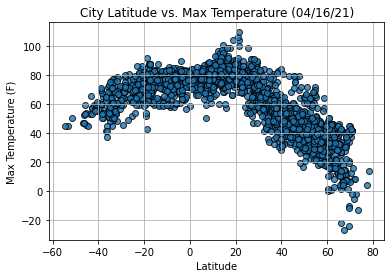
    


## Latitude vs. Humidity Plot


```python
# Create the scatter plots for latitude vs. humidity
plt.scatter(lats, 
            humidity,
            edgecolor="black", linewidths=1, marker="o", 
            alpha=0.8, label="Cities")

# Incorporate the other graph properties
plt.title("City Latitude vs. Humidity (%s)" % time.strftime("%x"))
plt.ylabel("Humidity (%)")
plt.xlabel("Latitude")
plt.grid(True)

# Save the figure
plt.savefig("output_data/Fig2.png")

# Show plot
plt.show()
```


    
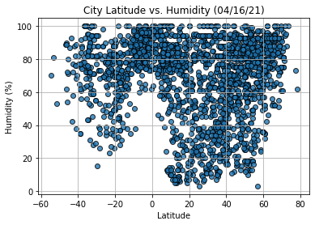
    


## Latitude vs. Cloudiness Plot


```python
# Create the scatter plots for latitude vs. cloudiness
plt.scatter(lats, 
            cloudiness,
            edgecolor="black", linewidths=1, marker="o", 
            alpha=0.8, label="Cities")

# Incorporate the other graph properties
plt.title("City Latitude vs. Cloudiness (%s)" % time.strftime("%x"))
plt.ylabel("Cloudiness (%)")
plt.xlabel("Latitude")
plt.grid(True)

# Save the figure
plt.savefig("output_data/Fig3.png")

# Show plot
plt.show()
```


    
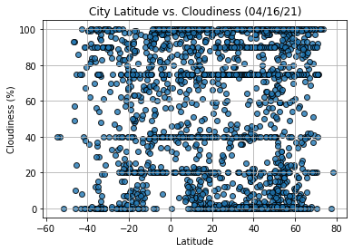
    


## Latitude vs. Wind Speed Plot


```python
#Create the scatter plots for latitude vs. wind speed
plt.scatter(lats, 
            wind_speed,
            edgecolor="black", linewidths=1, marker="o", 
            alpha=0.8, label="Cities")

# Incorporate the other graph properties
plt.title("City Latitude vs. Wind Speed (%s)" % time.strftime("%x"))
plt.ylabel("Wind Speed (mph)")
plt.xlabel("Latitude")
plt.grid(True)

# Save the figure
plt.savefig("output_data/Fig4.png")

# Show plot
plt.show()
```


    
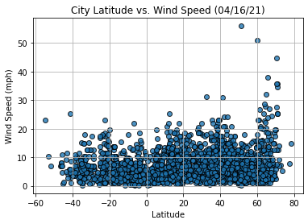
    


## Linear Regression


```python
# OPTIONAL: Create a function to create Linear Regression plots
```


```python
# Create Northern and Southern Hemisphere DataFrames
```

####  Northern Hemisphere - Max Temp vs. Latitude Linear Regression


```python

```

    The r-squared is: 0.8271188905041935
    


    
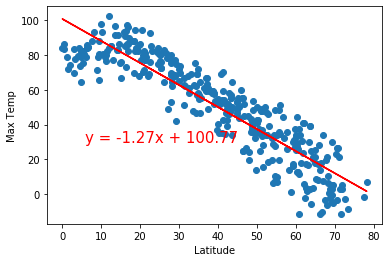
    


####  Southern Hemisphere - Max Temp vs. Latitude Linear Regression


```python

```

    The r-squared is: 0.39936284758885965
    


    
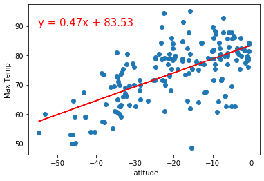
    


####  Northern Hemisphere - Humidity (%) vs. Latitude Linear Regression


```python

```

    The r-squared is: 0.10829462153873139
    


    
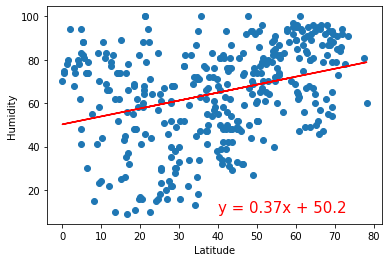
    


####  Southern Hemisphere - Humidity (%) vs. Latitude Linear Regression


```python

```

    The r-squared is: 0.0008996079328825663
    


    
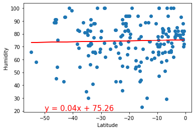
    


####  Northern Hemisphere - Cloudiness (%) vs. Latitude Linear Regression


```python

```

    The r-squared is: 0.05768812657005063
    


    
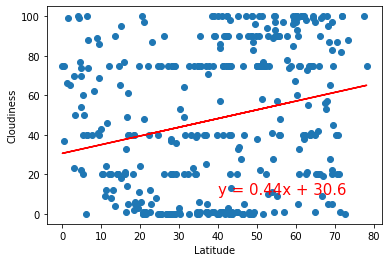
    


####  Southern Hemisphere - Cloudiness (%) vs. Latitude Linear Regression


```python

```

    The r-squared is: 0.0684912094859049
    


    
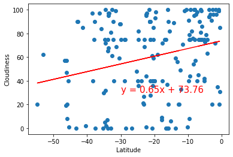
    


####  Northern Hemisphere - Wind Speed (mph) vs. Latitude Linear Regression


```python

```

    The r-squared is: 0.023371104533850804
    


    
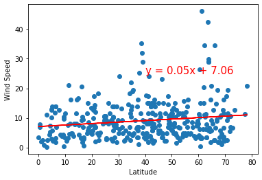
    


####  Southern Hemisphere - Wind Speed (mph) vs. Latitude Linear Regression


```python

```

    The r-squared is: 0.03381889207758188
    


    
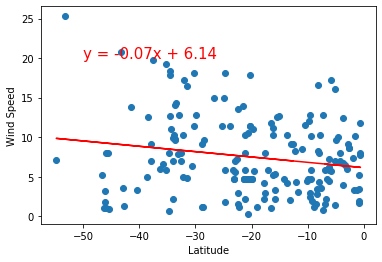
    


```python

```
